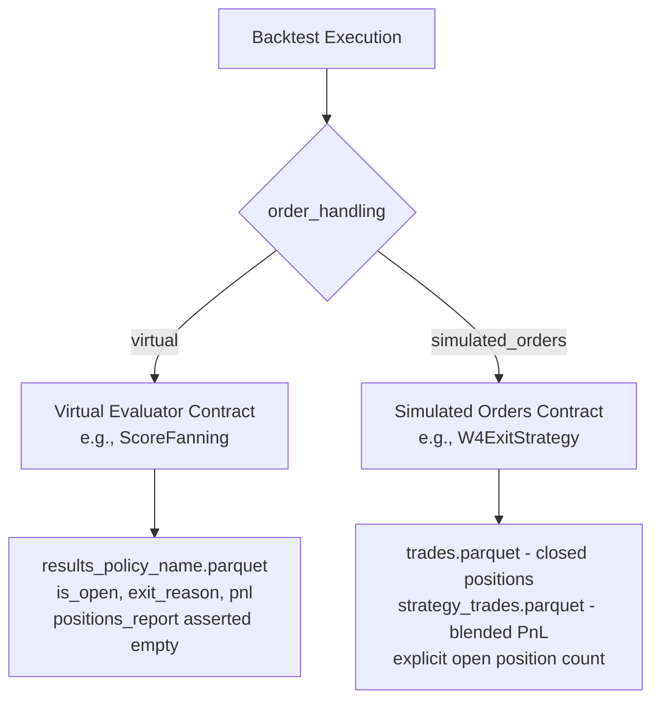

<!-- DOC-STATUS-BANNER -->
> **[DESIGN CONTRACT — CITED BY LIVE CODE]**
>
> `backtests/nt_runtime/engine_builder.py` cites §6.3 of this document.
>
> Section numbers here are load-bearing. Do not renumber, delete, or casually edit.
> This is a frozen contract, not a workflow manual — the current workflow is
> **`docs/RESEARCH_WORKFLOW.md`**. Classification: `docs/DOCUMENT_MAP.md`.

# Backtest Harness B0 Boundary & Inventory Decision (Revised)

**Status:** Phase B0 Complete (Revised per Red Team Review R1–R7)  
**Target:** Standardize the smallest existing canonical backtest path for new work without creating new packages, migrating legacy studies, or breaking the collector framework.

---

## 1. Inventory

> **How to read this section.** §1.A lists code that **exists today** and was verified present by
> reading the file. §1.B lists components that **do not exist yet** and are created or extracted
> during B1. Nothing in §1.B may be cited as an existing implementation.

### 1.A Canonical Existing Implementations (verified present)

The repository already contains proven, production-grade implementations for all core backtest concerns within `backtests/nt_runtime/` and `utils/runner/`. No new abstraction package (`common/`) is needed.

| Concern | Canonical Source File | Canonical Function / Class | Notes |
|---|---|---|---|
| **Instrument Factory** | [`backtests/nt_runtime/engine_builder.py`](file:///c:/Users/Scott%20McCarty/Projects/Nautilus%20Trader/backtests/nt_runtime/engine_builder.py) | `create_futures_instrument(data_plan: DataPlan) -> FuturesContract` | Uses `TestInstrumentProvider.future` with catalog metadata (`multiplier`, `price_increment`, `activation_ns`, `expiration_ns`). |
| **Engine Construction** | [`backtests/nt_runtime/engine_builder.py`](file:///c:/Users/Scott%20McCarty/Projects/Nautilus%20Trader/backtests/nt_runtime/engine_builder.py) | `build_engine(data_plan, log_level, telemetry) -> (BacktestEngine, FuturesContract)` | Configures `BacktestEngineConfig`, adds `XCME` margin venue with USD balance, adds instrument, loads & registers bars. |
| **Catalog Bar Loading** | [`utils/runner/data.py`](file:///c:/Users/Scott%20McCarty/Projects/Nautilus%20Trader/utils/runner/data.py) | `CausalDataLoader(catalog_path: Path).load_bars(bar_type, start, end)` | Process-local in-memory caching of decoded bars from `ParquetDataCatalog`. |
| **Causal Stream Order** | [`utils/causal_registration.py`](file:///c:/Users/Scott%20McCarty/Projects/Nautilus%20Trader/utils/causal_registration.py) | `add_bars_causal_order(engine, bars_1s, bars_1m)` | Guarantees 1s sub-bars at timestamp T dispatch before parent 1m bar at T (prevents MFE/MAE blind spots). |
| **Contract & Spec Loading** | [`backtests/nt_runtime/compiled_study_loader.py`](file:///c:/Users/Scott%20McCarty/Projects/Nautilus%20Trader/backtests/nt_runtime/compiled_study_loader.py) | `load_compiled_study(study_path) -> CompiledStudyData` | Loads `study.yaml` / `compiled_study.json`, validates spec SHA-256 integrity and runtime compatibility. |
| **Study Chronology & OOS Gates** | [`backtests/nt_runtime/data_plan.py`](file:///c:/Users/Scott%20McCarty/Projects/Nautilus%20Trader/backtests/nt_runtime/data_plan.py) | `resolve_data_plan(compiled_data, ...)` | Study-bound resolver: `PRODUCT_CATALOGS`, bar types, warmup arithmetic **plus** collector chronology, prohibited years, and OOS partition locks. |
| **Execution Stage Plan** | [`backtests/nt_runtime/run_plan.py`](file:///c:/Users/Scott%20McCarty/Projects/Nautilus%20Trader/backtests/nt_runtime/run_plan.py) | `resolve_run_plan(compiled_data, stage, reference_date) -> RunPlan` | Resolves bounded date ranges (`fixture`, `day`, `week`, `month`, `full`). |
| **Strategy & Config Binding** | [`backtests/nt_runtime/strategy_binding.py`](file:///c:/Users/Scott%20McCarty/Projects/Nautilus%20Trader/backtests/nt_runtime/strategy_binding.py) | `resolve_strategy_binding(binding_or_class, study_type, mode) -> StrategyBinding` | Resolves strategy classes from registry or fully qualified Python class paths (`strategies.pkg.Class`). |
| **Output & Run Manifest** | [`backtests/nt_runtime/output_manager.py`](file:///c:/Users/Scott%20McCarty/Projects/Nautilus%20Trader/backtests/nt_runtime/output_manager.py) | `OutputManager` | Manages `runs/YYYYMMDD_HHMMSS_<id>_<stage>/`, writes `run_manifest.json`, `status.json`, telemetry, and artifacts. |
| **Execution Telemetry** | [`backtests/nt_runtime/telemetry.py`](file:///c:/Users/Scott%20McCarty/Projects/Nautilus%20Trader/backtests/nt_runtime/telemetry.py) | `CausalTelemetry` / `TelemetrySnapshot` | Measures process RSS memory, tracemalloc peaks, wall time, throughput (bars/sec), and bar callback counts. |
| **Model Runtime & Scoring** | [`utils/runner/model.py`](file:///c:/Users/Scott%20McCarty/Projects/Nautilus%20Trader/utils/runner/model.py) | `PersistedModelRuntime` | Manages serialized model validation (SHA-256, ordered feature list) and inference scoring. |
| **State Checkpointing** | [`utils/runner/checkpoint.py`](file:///c:/Users/Scott%20McCarty/Projects/Nautilus%20Trader/utils/runner/checkpoint.py) | `DailyStateCheckpointer` | Atomic state serialization and `resume_manifest.json` verification. Used by `ScoreFanningStrategy.__init__` — see §6.5. |

### 1.B Components To Be Built In B1 (do not exist yet)

Verified absent at B0 time (`grep -rn "def resolve_catalog_plan"` → no match; paths below return `No such file`).

| Component | Target Path | Action | Purpose |
|---|---|---|---|
| `resolve_catalog_plan(symbol, start, end, warmup_days)` | `backtests/nt_runtime/data_plan.py` | **EXTRACT** | Generic catalog/instrument/bar-type/warmup resolution with **no** study chronology gates. `resolve_data_plan` becomes a thin study-bound wrapper that calls it and then applies the gates. |
| `ExecutionMode` contract | `backtests/nt_runtime/engine_builder.py` | **ADD** | Replaces the implicit venue defaults with the declared, hashed contract in §2. |
| `run_backtest_mode(...)` | `backtests/nt_runtime/modes/backtest.py` | **NEW** | Mode orchestrator implementing the two output contracts in §3. Mirrors `modes/collect.py`. |
| Standalone CLI | `backtests/run_backtest.py` | **NEW** | Supported entrypoint for non-collector backtests. |
| Backtest strategy registrations | `backtests/nt_runtime/strategy_binding.py` | **MODIFY** | Register `w4_exit_strategy`; restrict dotted-path imports to an allowlist. |
| Equivalence + contract tests | `scripts/tests/test_nt_runner_backtest.py` | **NEW** | Golden equivalence against the frozen baselines plus negative tests. |
| Baseline capture runner | `scripts/capture_baseline_fixtures.py` | **NEW** | Implements `BASELINE_CAPTURE_RERUN_PLAN.md`; prerequisite for the above (§5). |

---

## 2. Declared Execution-Mode Contract

A single boolean (`bar_execution`) is insufficient to describe backtest semantics. The backtest harness requires a structured `execution_mode` contract declared in configuration and echoed into `run_manifest.json`:

```yaml
execution_mode:
  order_handling: virtual | simulated_orders    # Key field selecting output schema (virtual evaluators vs NT orders)
  fill_model: bar | tick                        # Fill simulation granularity
  bar_execution: true                           # Enables NT bar-level order matching
  bar_adaptive_high_low_ordering: true          # Realistic bar price path resolution
  oms_type: NETTING                             # NT OMS model
  account_type: MARGIN                          # NT account model
  base_currency: USD
  starting_balance: 1_000_000
  commission_model: none                        # Explicit commission model name
  slippage_model: none                          # Explicit slippage model name
  run_window:
    mode: bounded | all_loaded                  # engine.run(start, end) vs engine.run()
    warmup_days: 5
    warmup_dispatched: true | false             # Observed callback dispatch during lead-in window
```

---

## 3. Two Distinct Output Contracts Keyed by `order_handling`

The harness supports two explicit output schemas determined by `execution_mode.order_handling`:



### 1. `virtual` (e.g. `ScoreFanningStrategy`)
For strategies that maintain internal evaluators/fanning portfolios without placing broker orders:
- **Output Artifacts:** `backtest/results_{evaluator_name}.parquet` (one file per evaluated policy, e.g. `results_R5.parquet`, `results_R2.5.parquet`), containing:
  - `trade_id`, `entry_time`, `entry_px`, `direction`, `qty`, `atr`, `exit_time`, `exit_px`, `exit_reason`, `pnl`, `is_open`.
- **NT Positions Report:** Asserted empty (`engine.trader.generate_positions_report()` returns 0 rows; emptiness is a verified baseline property).
- **Summary Metrics:** `backtest/metrics.json` recording per-policy trade count, gross PnL, win rate, and `exit_reason` distribution.

### 2. `simulated_orders` (e.g. `W4ExitStrategy`, `BaselineFlipParityStrategy`)
For strategies that submit orders to NautilusTrader's simulated exchange:
- **Output Artifacts:**
  - `backtest/trades.parquet`: `engine.trader.generate_positions_report()` filtered strictly to closed positions (`ts_closed.notna()`).
  - `backtest/strategy_trades.parquet`: `strategy.all_trades` (blended PnL for partial scale-outs, exact fill prices, policy logs).
  - **Open Positions:** Explicit count and details of open positions (`ts_closed.isna()`) recorded separately in `status.json` / `metrics.json`.
- **Summary Metrics:** `backtest/metrics.json` recording total closed trades, win rate, profit factor, gross/net PnL, commissions, slippage, and max drawdown.

---

## 4. Standalone Execution vs Sealed Collector Studies

**Critical Authority Rule:**
A sealed collector study (such as `studies/Gemini_clean_maturity_flip_rolling_5m_productivity`) binds an immutable `strategy_class` (`FlipPredictionCollector`), a frozen 60-feature contract, and a sealed 53-file AST closure.
- `--strategy` must **NEVER** override a sealed study's declared `strategy_class`.
- If a study is sealed, the strategy it seals is the only strategy permitted to execute under that study identity.

### Proposed Standalone Backtest Invocations (Phase B1)

Non-collector backtests do not execute under collector study directories. They are invoked either via a standalone backtest config (`backtests/configs/<name>.yaml`) or via standalone CLI arguments:

#### Fixture 1: ScoreFanning Multi-Policy (Virtual Evaluator)
```bash
python backtests/run_backtest.py \
  --strategy score_fanning_strategy \
  --symbol NQ \
  --start-date 2023-03-03 \
  --end-date 2023-03-03 \
  --warmup-days 5 \
  --order-handling virtual
```

#### Fixture 2: W4 Weakness Exit Strategy (Simulated Orders — Full-Year 2023)
```bash
python backtests/run_backtest.py \
  --strategy strategies.w4_exit_strategy.W4ExitStrategy \
  --symbol NQ \
  --start-date 2023-01-01 \
  --end-date 2023-12-31 \
  --warmup-days 5 \
  --order-handling simulated_orders \
  --param year=2023 \
  --param policy=B1 \
  --param theta=0.62 \
  --param N=10 \
  --param entry_qty=1 \
  --param sl_atr=1.0 \
  --param tp_atr=1.0 \
  --param ma_period=9 \
  --param ma_type=SMA \
  --param trade_side=both \
  --param entry_type=flip \
  --param entry_prob=0.040 \
  --param use_stall_protection=false \
  --param gate_atr=0.5 \
  --param stall_thresh=3 \
  --param use_trailing_stop=false \
  --param trail_distance_atr=0.25 \
  --param be_trigger_atr=0.25 \
  --param be_level_atr=0.25
```
*(Note: Single-day W4 runs are classified strictly as plumbing smoke tests, never equivalence fixtures. `entry_qty` is derived as 2 for Policy B4, 1 for B0/B1/B2/B3/B5).*

---

## 5. Mandatory Baseline-Capture Specification (Prerequisite before B1)

Before any Phase B1 implementation begins, exact baselines from unmodified legacy runs must be captured and frozen.

| Baseline Dimension | Fixture 1 — ScoreFanning | Fixture 2 — W4 Exit Policy B1 |
|---|---|---|
| **Legacy Command** | `python backtests/run_staged_backtest.py --start-date 2023-03-03 --end-date 2023-03-03` | `python backtests/run_w4_backtest.py --year 2023 --policy B1 --theta 0.62 --N 10` |
| **Data Load Window** | `2023-02-26 00:00:00` .. `2023-03-03 23:59:59` UTC | `2022-12-27 00:00:00` .. `2023-12-31 23:59:59` UTC |
| **Replay Run Window** | `engine.run(start=2023-03-03, end=2023-03-03)` | `engine.run(start=2023-01-01)` (no end) |
| **Warmup Dispatch** | 5 calendar days lead-in. Record bar counts loaded vs bar callbacks received per timeframe (pin whether lead-in is dispatched or skipped). | 5 calendar days lead-in. Record bar counts loaded vs bar callbacks received per timeframe. |
| **External Inputs** | `DailyStateCheckpointer` directory state (`--resume` inactive). | SHA-256 of `studies/regime_sequence_signal_audit/results/weakness_checkpoint_predictions.parquet`, plus row count for `year==2023`. |
| **Catalog Identity** | `data/catalog/NQ_v0_2020_2026`; row counts and first/last `ts_event`, `ts_init`. | `data/catalog/NQ_v0_2020_2026`; row counts and first/last `ts_event`, `ts_init`. |
| **Instrument / Venue** | `NQ.XCME` (mult 20, tick 0.25); Venue `XCME`, `NETTING`, `MARGIN`, USD $1,000,000, `bar_execution=True`, `bar_adaptive_high_low_ordering=True`. Exclude `trader_id` (`STAGED-BACKTESTER`). | `NQ.XCME` (mult 20, tick 0.25); Venue `XCME`, `NETTING`, `MARGIN`, USD $1,000,000, `bar_execution=True`, `bar_adaptive_high_low_ordering=True`. Exclude `trader_id` (`W4-BACKTESTER`). |
| **Strategy Config** | Full resolved `ScoreFanningConfig` (policies: R5 @ 0.62, R2.5 @ 0.50, `sl_atr_mult=1.5`, `pt_atr_mult=2.0`). | Full resolved `W4ExitConfig` (all 19 fields pinned to legacy defaults, `year=2023`, `entry_qty=1`). |
| **Fills** | **None** (assert empty). | Every fill: timestamp, side, qty, price, liquidity side, order type, commission. |
| **Closed Positions** | N/A (virtual trades only). | `generate_positions_report()` filtered to `ts_closed.notna()`: row count and per-row fields. |
| **Open Positions** | Count of evaluator trades with `is_open == True` at end of run. | Count of positions with `ts_closed.isna()` (recorded separately). |
| **P&L / Costs** | Per-policy: trade count, gross PnL, win rate, and `exit_reason` distribution. | Total and per-trade PnL from positions report & `strategy.all_trades`; commission & slippage totals. |
| **Outputs to Hash** | `results_R5.parquet`, `results_R2.5.parquet` | `trades.parquet`, `strategy_trades.parquet`, plus unmanaged side-effect `w4_parity_2023_B1.parquet`. |

### Comparison Tolerances
- **Exact Matches (0 tolerance):** Timestamps, order/position counts, sides, quantities, `exit_reason` strings, and tick-quantised prices (0.25).
- **Float Metric Tolerance ($10^{-9}$ relative):** Aggregate sums (total PnL, profit factor).
- **Hashing Rule:** Sort rows deterministically and hash parquet contents excluding volatile run metadata (`trader_id`, generated timestamps).

---

## 6. Known Gaps & Unsupported Cases in B1

1. **Non-Futures Instruments:** Currently `engine_builder.py` specifically configures CME futures contracts (NQ, ES). Cash equities, crypto spot/perps, and FX venues are unsupported without catalog schema extension.
2. **Dynamic Intra-Run Parameter Sweeps:** The canonical backtest harness executes one parameter set per run. Sweeps must be orchestrated as a batch of bounded runs, preserving individual run manifest provenance.
3. **Tick / MBP-1 Order Book Replay:** `engine_builder.py` currently loads 1s and 1m bar streams. Tick-level MBP-1 L2/L3 order book feeds require dedicated catalog loaders and order book venues.
4. **Live Execution & Broker Connectors:** The harness is strictly a backtesting and research simulation engine using `ParquetDataCatalog`. Live exchange order routing is unsupported.
5. **State Checkpointing / Resumes — split, not wholly unsupported.** The golden ScoreFanning fixture *does* depend on part of this, so it cannot be declared unsupported wholesale:
   - **IN SCOPE (required by Fixture 1).** `ScoreFanningConfig.checkpoint_dir` must be settable, because (a) `ScoreFanningStrategy.__init__` unconditionally constructs `DailyStateCheckpointer(Path(config.checkpoint_dir))`, (b) the strategy writes `checkpoint_<day>.pkl` + `resume_manifest.json` on every day rollover via `save_daily_checkpoint`, and (c) the legacy runner writes its `results_<policy>.parquet` outputs into that same directory. B1 must therefore route `checkpoint_dir` into the run's own output directory and treat the checkpoint files as declared run artifacts.
   - **OUT OF SCOPE (not exercised by either baseline).** The `--resume` path — `DailyStateCheckpointer.verify_manifest` + `strategy.load_daily_checkpoint` + the start-date advance. Both baseline commands run with `--resume` absent (`action="store_true"`, default `False`), so no baseline covers resumption. B1 does not implement `--resume`; requesting it must raise an explicit unsupported-feature error rather than silently ignoring the flag.
6. **Unmanaged Strategy Side-Effects:** Legacy `w4_exit_strategy.py:266` writes `backtests/results/w4_parity_{year}_{policy}.parquet` directly on stop outside `runs/`. This will be documented as an unmanaged legacy side-effect during B1.

---

## 7. Exact Files Targeted for Phase B1 & Seal Invalidation Sequence

> [!WARNING]
> **Collector Seal Invalidation Notice:**  
> `engine_builder.py`, `data_plan.py`, and `strategy_binding.py` are part of the collector study's 53-file sealed AST closure. Any byte modification to these files will change the composite SHA-256, invalidating the Gemini pre-execution audit seal, both audit statuses, and current smoke acceptance.
> 
> Therefore, Phase B1 must explicitly sequence:
> 1. Implementation of changes.
> 2. Execution of deterministic preflight (`scripts/research_preflight.py`).
> 3. Re-running pre-execution audits (`scripts/run_preexec_audits.py`).
> 4. Re-generating the pre-execution audit seal (`scripts/preexec_audit_seal.py`).
> 5. Re-validating the 1-day smoke run (`scripts/validate_smoke.py`).

| Action | Target File | Description |
|---|---|---|
| **[MODIFY]** | [`backtests/nt_runtime/data_plan.py`](file:///c:/Users/Scott%20McCarty/Projects/Nautilus%20Trader/backtests/nt_runtime/data_plan.py) | Extract `resolve_catalog_plan(symbol, start, end, warmup_days)` for generic catalog/instrument resolution, while preserving `resolve_data_plan(...)` for collector study chronology gates. |
| **[MODIFY]** | [`backtests/nt_runtime/engine_builder.py`](file:///c:/Users/Scott%20McCarty/Projects/Nautilus%20Trader/backtests/nt_runtime/engine_builder.py) | Make venue settings (`bar_execution`, `bar_adaptive_high_low_ordering`) configurable based on declared `execution_mode`. |
| **[MODIFY]** | [`backtests/nt_runtime/strategy_binding.py`](file:///c:/Users/Scott%20McCarty/Projects/Nautilus%20Trader/backtests/nt_runtime/strategy_binding.py) | Register `W4ExitStrategy` / `W4ExitConfig` in `STRATEGY_REGISTRY` for backtest mode. |
| **[NEW]** | [`backtests/nt_runtime/modes/backtest.py`](file:///c:/Users/Scott%20McCarty/Projects/Nautilus%20Trader/backtests/nt_runtime/modes/backtest.py) | Implements `run_backtest_mode` supporting `virtual` and `simulated_orders` output contracts. |
| **[NEW]** | [`backtests/run_backtest.py`](file:///c:/Users/Scott%20McCarty/Projects/Nautilus%20Trader/backtests/run_backtest.py) | Dedicated CLI entrypoint for standalone backtest execution. |
| **[NEW]** | [`scripts/tests/test_nt_runner_backtest.py`](file:///c:/Users/Scott%20McCarty/Projects/Nautilus%20Trader/scripts/tests/test_nt_runner_backtest.py) | Deterministic unit tests and golden equivalence tests against frozen baselines. |
