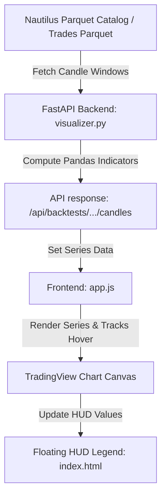

# Nautilus Trader Visualizer Extension Guide

This guide defines the standardized methodology for adding new indicators, signals, or overlays (e.g., HMM states, ML probabilities, vwap, etc.) to the interactive TradingView backtest visualizer. 

Follow this checklist and architecture model whenever you prompt a coding agent to add a new visual indicator.

---

## Architecture Overview

The visualizer functions as a single-page web dashboard using a FastAPI backend and a TradingView Lightweight Charts frontend.



---

## Step-by-Step Extension Methodology

### Step 1: Backend Calculation (`utils/visualizer.py`)
Add the calculation logic inside `compute_indicators(df_candles)`. 
* **Input**: `df_candles` is a pandas `DataFrame` aggregated to the user's active chart resolution.
* **Output**: A dictionary list of coordinate pairs: `{"time": unix_seconds, "value": float_val}`.

*Example:*
```python
# utils/visualizer.py inside compute_indicators(df_candles)
# Compute a custom indicator (e.g., Simple Moving Average 20)
sma20 = df_candles['close'].rolling(window=20).mean()

# Convert series to TV-compliant list of time/value coordinates
timestamps = (df_candles['timestamp'] // 1_000_000_000).tolist()
indicators_dict["sma20"] = [
    {"time": t, "value": v} 
    for t, v in zip(timestamps, sma20.tolist()) 
    if not math.isnan(v)
]
```

---

### Step 2: Frontend Series Registration (`utils/visualizer_frontend/app.js`)
Declare the chart series instance in the global references and initialize it inside `initChart()`.

1. **Add reference key** to the `series` object:
   ```javascript
   let series = {
       candles: null,
       // ... existing indicators
       sma20: null // New reference
   };
   ```

2. **Initialize series** in `initChart()`. Decide if the indicator belongs on the **Main Pane (Pane 0)** or a **Sub-Pane (Pane 1, 2, etc.)**:
   ```javascript
   // Overlay on Main Price Pane (0)
   series.sma20 = chart.addSeries(LightweightCharts.LineSeries, {
       color: '#4caf50',
       lineWidth: 1.5,
       lastValueVisible: false // Keeps the right price axis clean
   }, 0); 
   
   // OR: Render on a separate bottom pane (e.g. Pane 2)
   series.hmm = chart.addSeries(LightweightCharts.LineSeries, {
       color: '#e040fb',
       lineWidth: 2,
       lastValueVisible: false
   }, 2); // Pane index 2
   ```

3. **Adjust Pane Heights** (if adding new panes):
   ```javascript
   const panes = chart.panes();
   if (panes && panes.length >= 3) {
       panes[0].setStretchFactor(6); // Main chart
       panes[1].setStretchFactor(2); // ATR
       panes[2].setStretchFactor(2); // New HMM pane
   }
   ```

---

### Step 3: Populate Data (`utils/visualizer_frontend/app.js`)
Update `loadChartData()` to set the values on your new series whenever a trade is loaded.

```javascript
// inside loadChartData()
if (indicators.sma20) {
    series.sma20.setData(indicators.sma20);
} else {
    series.sma20.setData([]);
}
```

---

### Step 4: Legend UI & Hover Tracking
Ensure the indicator's value updates in the floating HUD legend when the user hovers over the chart.

1. **Add DOM Element** in `utils/visualizer_frontend/index.html` inside the `#chart-legend` container:
   ```html
   <div class="legend-row">
       <span class="legend-indicator sma20">SMA 20:</span>
       <span id="legend-sma20">-</span>
   </div>
   ```

2. **Add CSS Colors** in `utils/visualizer_frontend/style.css`:
   ```css
   .legend-indicator.sma20 {
       color: #4caf50;
   }
   ```

3. **Track Crosshair** in `app.js` (`subscribeCrosshairMove`):
   ```javascript
   data.sma20 = param.seriesData.get(series.sma20);
   ```

4. **Update HUD** in `app.js` (`updateLegendValues`):
   ```javascript
   const smaEl = document.getElementById("legend-sma20");
   if (smaEl) {
       if (data.sma20) {
           smaEl.innerHTML = `Val: <span style="color:#4caf50">${data.sma20.value.toFixed(2)}</span>`;
       } else {
           smaEl.innerHTML = "-";
       }
   }
   ```

---

## Best Practices for AI Coding Agents

1. **Keep the Right Axis Clean**: Always set `lastValueVisible: false` on indicators. Only the active price lines (Entry/Exit) and the main candles should have visible labels on the right price scale.
2. **Disable line titles next to curves**: Never set the `title` property inside `addSeries` options. It draws large colored title boxes directly over the chart canvas. Hardcode titles inside `index.html`'s HUD legend instead.
3. **Handle NaNs**: Pandas calculations often produce `NaN` or `None` values (e.g. shifting or rolling averages). Always filter them out (`if not math.isnan(v)`) on the backend before sending JSON to the browser.
4. **Graceful Fallbacks**: If a study or backtest does not support the new indicator, ensure the backend returns `[]` or `None` without crashing the trade details load.
