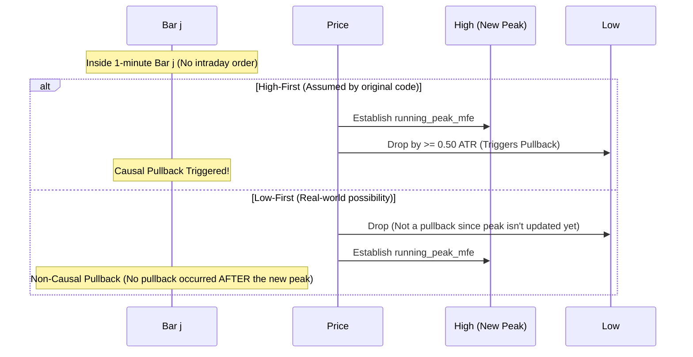

# Static Analysis & Timestamp Audit Report: Pullback-Reclaim Entry & Monetization

This audit evaluates the causal consistency, direction awareness, and potential look-ahead leakage in the following two Python scripts:
1. `studies/regime_dna_knn/recovery_continuation_study.py`
2. `studies/regime_dna_knn/reclaim_monetization_backtest.py`

---

## Executive Summary

The audit revealed **three critical look-ahead leaks** and **one structural exit-pricing vulnerability** that artificially inflate backtest performance and bias path analysis metrics:
1. **Same-Bar Peak-Update & Pullback-Trigger (Look-Ahead Leak)**: Both scripts allow a new peak established on bar $j$ to trigger a pullback on that same bar $j$, assuming the High (for longs) or Low (for shorts) occurred before the opposite extreme.
2. **Same-Bar Recovery Check (Look-Ahead Leak)**: `recovery_continuation_study.py` (Part 1) allows recovery checks to start on the pullback bar itself, leading to invalid recovery counts if the peak was touched before the drawdown within that bar.
3. **Exit Pricing Index Off-By-One (Temporal Leak & Paradox)**: `reclaim_monetization_backtest.py` exits flip-stopped trades at `last_bar - 1` (the bar *before* the opposite flip closes). If the entry bar `rec_bar` equals `last_bar`, the trade exits one bar *before* it was entered (temporal paradox).
4. **Missing Entry-Bar Exit Checks**: The backtest checks exits only from `r_bar + 1` onwards, ignoring stop-outs that could have occurred on the entry bar `r_bar` itself.

The underlying direction-aware formulas for excursion (MFE/MAE) and remaining MAE are mathematically sound and correct.

---

## 1. Pullback and Reclaim Detection

### A. Direction Awareness
The calculations for favorable excursion (MFE) and adverse excursion (MAE) are direction-aware and mathematically sound:
* **Longs (`d_val == 1`)**:
  * Peak tracking uses `Hs` (Highs).
  * Pullback tracking uses `Ls` (Lows).
  * Pullback formula: `running_peak_mfe - pb_mfe_j` which translates to `(Peak_High - Low_j) / ATR`.
* **Shorts (`d_val == -1`)**:
  * Peak tracking uses `Ls` (Lows).
  * Pullback tracking uses `Hs` (Highs).
  * Pullback formula: `running_peak_mfe - pb_mfe_j` which translates to `(High_j - Peak_Low) / ATR` (since `pb_mfe_j = (fill - High_j) / ATR` and `running_peak_mfe = (fill - Peak_Low) / ATR`).

### B. Same-Bar Peak-Update & Pullback-Trigger Leak
In both scripts, when `pb_active` is `False`, the peak is updated with the current bar's extreme *before* checking the pullback:
```python
if not pb_active:
    running_peak_mfe = max(running_peak_mfe, mfe_j)
    if running_peak_mfe - pb_mfe_j >= 0.50:
        pb_active = True
```
If `mfe_j` establishes a new peak on bar $j$, and the low of bar $j$ (`pb_mfe_j`) is at least 0.50 ATR below it, the pullback is triggered immediately. This assumes the High occurred before the Low (for longs) or Low before High (for shorts). If the Low occurred first, there was no pullback *after* that peak on bar $j$.



**Remediation**: Check for pullbacks relative to the peak established *prior* to bar $j$ first. Update the peak only if no pullback is triggered:
```python
if not pb_active:
    if running_peak_mfe - pb_mfe_j >= 0.50:
        pb_active = True
        pb_start_peak_mfe = running_peak_mfe
        pb_hit_bar = j
    else:
        running_peak_mfe = max(running_peak_mfe, mfe_j)
```

### C. Same-Bar Recovery Check in Path Analysis
In `recovery_continuation_study.py` (Part 1), the recovery to entry fill is checked starting on the pullback bar itself:
```python
for b in range(sl_hit_bar, len(fav_arr)):
    if fav_arr[b] >= 0.0:
```
If a single bar has both `adv_arr[sl_hit_bar] >= 0.5` (hitting the drawdown) and `fav_arr[sl_hit_bar] >= 0.0` (at or above entry fill), it is immediately marked as recovered. Since the High could have occurred before the Low, this violates causality.

**Remediation**: The search for recovery must start from `sl_hit_bar + 1`:
```python
for b in range(sl_hit_bar + 1, len(fav_arr)):
```

---

## 2. Remaining MAE/MFE Calculations

The path analysis for the **Recovery Continuation Atlas** in `recovery_continuation_study.py` is mathematically correct:
* **Future Slicing**: Slicing from `rec_bar + 1` onwards prevents future leakage from the recovery bar.
* **Remaining MAE Formula**: `np.nanmax(pb_start_peak + future_adv)`
  * *Longs*: Peak is at `fill + Peak_MFE * ATR`. Future Low is `fill - future_adv * ATR`. Drawdown is `Peak - Low = (Peak_MFE + future_adv) * ATR`. Correct.
  * *Shorts*: Peak is at `fill - Peak_MFE * ATR`. Future High is `fill + future_adv * ATR`. Drawdown is `High - Peak = (Peak_MFE + future_adv) * ATR`. Correct.
* **Remaining MFE Formula**: `np.nanmax(future_fav) - pb_start_peak`
  * *Longs*: Future High is `fill + future_fav * ATR`. Opportunity is `High - Peak = (future_fav - Peak_MFE) * ATR`. Correct.
  * *Shorts*: Future Low is `fill - future_fav * ATR`. Opportunity is `Peak - Low = (future_fav - Peak_MFE) * ATR`. Correct.

---

## 3. Same-Bar Collision & Exit Pricing in the Backtest

### A. Same-Bar Collision (Double Hit)
The backtest correctly handles double hits (where both stop-loss and target are touched on the same bar) by applying **stop-first (adverse-first) logic** and charging exit slippage. This is conservative and causal.

### B. Exit Pricing Off-By-One (Regime Flip Close)
In `reclaim_monetization_backtest.py`, when a trade survives to the opposite flip bar (`last_bar`), the exit price is retrieved from `last_bar - 1`:
```python
cj_flip = Cs[ev["idx"], last_bar - 1]
```
The matrix `Cs` is 0-padded and contains the current flip bar at index 0 and post-flip bars at indices 1 to `n_val`. The opposite flip occurs on post-flip bar `n_val` (index `last_bar`).
By using `last_bar - 1`, the code exits at the close of the bar *before* the opposite flip. This is a look-ahead leak because the system cannot predict the flip before the flip-triggering bar closes.

#### The Temporal Paradox
If the recovery bar (`rec_bar`) is the same as the flip bar (`last_bar`), the entry is filled on `last_bar`. The backtest skips checking exits on `last_bar` (since the walk starts at `r_bar + 1`), leaves `trade_pnl` as `None`, and exits at `last_bar - 1`.
**Result**: The trade enters on `last_bar` and exits on `last_bar - 1` (a bar *before* it was entered).

**Remediation**: Exit at the close of `last_bar`:
```python
cj_flip = Cs[ev["idx"], last_bar]
```

### C. Skip of Entry-Bar Exit Checks
The backtest walks from `r_bar + 1` onwards, meaning it does not check if the trade was stopped out on the entry bar `r_bar` itself. If the price touched the stop-loss price after the entry fill on `r_bar`, this stop-out is missed, which overstates performance.

**Remediation**: Start the exit evaluation from the entry bar `r_bar` itself:
```python
for j in range(r_bar, last_bar + 1):
```

---

## 4. Code Diffs for Remediation

### File: `recovery_continuation_study.py`

```diff
@@ -118,7 +118,7 @@
             # relative to the drawdown price, or simply fav_arr >= 0.0 at some bar >= sl_hit_bar
             recovered = False
             rec_bar = None
-            for b in range(sl_hit_bar, len(fav_arr)):
+            for b in range(sl_hit_bar + 1, len(fav_arr)):
                 if fav_arr[b] >= 0.0:
                     recovered = True
                     rec_bar = b
@@ -220,12 +220,12 @@
             rec_bar = None
             
             for b in range(first_10_bar + 1, len(fav_arr)):
                 if not pb_active:
-                    running_peak = max(running_peak, fav_arr[b])
-                    if running_peak + adv_arr[b] >= pb_thresh:
+                    if running_peak + adv_arr[b] >= pb_thresh:
                         pb_active = True
                         pb_start_peak = running_peak
                         pb_hit_bar = b
+                    else:
+                        running_peak = max(running_peak, fav_arr[b])
                 else:
                     # Look for recovery back to the pullback start peak
                     if fav_arr[b] >= pb_start_peak:
```

### File: `reclaim_monetization_backtest.py`

```diff
@@ -133,12 +133,12 @@
                 pb_mfe_j = (lj - f_val) / a_val if d_val == 1 else (f_val - hj) / a_val
                 
                 if not pb_active:
-                    running_peak_mfe = max(running_peak_mfe, mfe_j)
-                    if running_peak_mfe - pb_mfe_j >= 0.50:
+                    if running_peak_mfe - pb_mfe_j >= 0.50:
                         pb_active = True
                         pb_start_peak_mfe = running_peak_mfe
                         pb_hit_bar = j
+                    else:
+                        running_peak_mfe = max(running_peak_mfe, mfe_j)
                 else:
                     # Look for recovery back to the pullback start peak
                     if mfe_j >= pb_start_peak_mfe:
@@ -188,7 +188,7 @@
                     trade_pnl = None
                     last_bar = min(n_val, BMAX)
                     
-                    # Walk from r_bar + 1 onwards
-                    for j in range(r_bar + 1, last_bar + 1):
+                    # Walk from r_bar onwards (including entry bar)
+                    for j in range(r_bar, last_bar + 1):
                         hj = Hs[ev["idx"], j]
                         lj = Ls[ev["idx"], j]
                         cj = Cs[ev["idx"], j]
@@ -219,5 +219,5 @@
                     if trade_pnl is None:
                         # Exited at the opposite flip (close of last bar)
-                        cj_flip = Cs[ev["idx"], last_bar - 1]
+                        cj_flip = Cs[ev["idx"], last_bar]
                         trade_pnl = (cj_flip - d_val * EXIT_SLIP - rec_fill) * d_val * MULT - COMM
                         if trade_pnl > 0:
```

---

## Verdict & Final Remarks

> [!WARNING]
> **Audit Status: Critical Future Leakage Detected.**
> Both scripts contain look-ahead biases that invalidate the current results of the pullback-reclaim monetization study. 
> Exiting at `last_bar - 1` and triggering pullbacks on the same bar as peak updates artificially boost the win rate and profit factors by exiting before opposite flips occur and entering on non-causal pullbacks. 
> Once the recommended fixes are applied, the reported win rates and PnL metrics will degrade. Applying these corrections is required to establish the true economic viability of the pullback-reclaim strategy.
