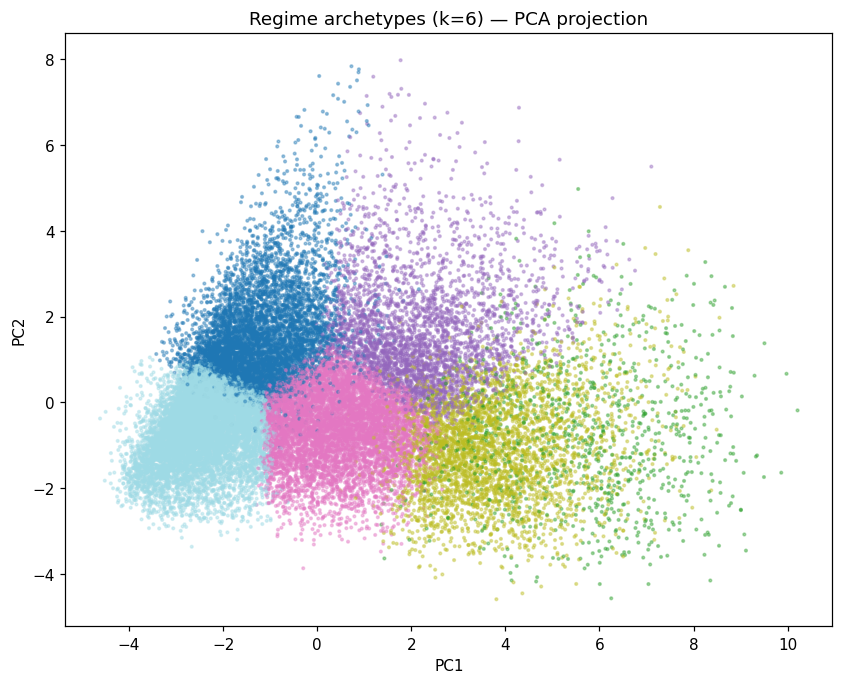

# Regime Archetype Discovery (k=6 KMeans on whole-regime shape)

143,872 1m regimes (2021–2026) clustered on 14 full-regime shape descriptors (length, total MFE/MAE, efficiency, pullbacks, 5s flips, slope decay, volume, opening-bar return). Discovery is **retrospective** (uses the whole regime). Early causal identifiability is tested in §4.

## 1. Archetypes

| Archetype | % | n | Avg len | Avg MFE | Avg MAE | Eff | Pullbacks | 5s flips | Slope decay | %Long |
| --- | --- | --- | --- | --- | --- | --- | --- | --- | --- | --- |
| Clean trend (c1) | 3.2% | 4,593 | 30 | 8.06 | 0.16 | 0.98 | 3.8 | 25.8 | +0.184 | 47% |
| Clean trend (c4) | 12.0% | 17,207 | 35 | 6.19 | 0.82 | 0.87 | 4.6 | 32.2 | +0.089 | 56% |
| Clean trend (c2) | 11.2% | 16,093 | 15 | 3.74 | 0.79 | 0.81 | 2.4 | 15.1 | +0.319 | 52% |
| Mixed trend (c3) | 23.8% | 34,228 | 15 | 2.07 | 0.77 | 0.72 | 2.4 | 16.7 | +0.118 | 49% |
| Chop/reversal (c0) | 19.8% | 28,427 | 8 | 0.77 | 2.16 | 0.24 | 1.2 | 7.4 | +0.191 | 51% |
| Chop/reversal (c5) | 30.1% | 43,324 | 5 | 0.47 | 1.37 | 0.25 | 0.8 | 5.5 | +0.044 | 47% |

## 2. Atlas cross-reference — archetype vs KNN score & forward PnL (OOS)
| Archetype | OOS bars | Mean score_opportunity | Mean actual fwd PnL ($) |
| --- | --- | --- | --- |
| Clean trend | 197,987 | 1.079 | $+162.23 |
| Mixed trend | 114,492 | 0.939 | $-118.39 |
| Chop/reversal | 89,734 | 0.935 | $-228.42 |

## 3. Does archetype explain the Decile-9-positive / Decile-10-negative rollover?
| Score decile | n | Mean bar idx | Mean rem. bars | Mean fwd PnL ($) | Dominant archetype (share) |
| --- | --- | --- | --- | --- | --- |
| 1 | 40,222 | 11.4 | 16.1 | $-7.39 | Clean trend (37%) |
| 2 | 40,221 | 10.1 | 16.1 | $-8.11 | Clean trend (36%) |
| 3 | 40,221 | 9.4 | 15.8 | $-5.28 | Clean trend (37%) |
| 4 | 40,221 | 9.1 | 16.7 | $-6.44 | Clean trend (40%) |
| 5 | 40,222 | 8.9 | 16.0 | $-6.64 | Clean trend (43%) |
| 6 | 40,221 | 8.7 | 17.0 | $-5.76 | Clean trend (46%) |
| 7 | 40,221 | 8.7 | 17.9 | $-4.62 | Clean trend (51%) |
| 8 | 40,221 | 8.8 | 18.3 | $-0.89 | Clean trend (57%) |
| 9 | 40,221 | 9.2 | 18.6 | $+1.70 | Clean trend (64%) |
| 10 | 40,222 | 11.3 | 20.8 | $-4.62 | Clean trend (81%) |

## 4. Are archetypes identifiable EARLY (causally, bars 1–5)? — the tradeability bridge
RandomForest on bars-1–5 features only, trained on 2021–2024, tested on 2025–2026.
- OOS archetype accuracy: **62.0%** vs majority-class baseline 29.4% (6 classes).
- Lift over baseline: **+32.6pp**. Archetypes ARE partly recognizable early → a causal 'which regime am I in?' classifier is worth building.

## Year-stability of archetype prevalence (%)
| Year | c0 | c1 | c2 | c3 | c4 | c5 |
| --- | --- | --- | --- | --- | --- | --- |
| 2021 | 20 | 3 | 11 | 24 | 11 | 30 |
| 2022 | 20 | 3 | 11 | 24 | 12 | 30 |
| 2023 | 20 | 3 | 11 | 24 | 12 | 31 |
| 2024 | 20 | 3 | 12 | 23 | 12 | 31 |
| 2025 | 20 | 3 | 11 | 24 | 12 | 29 |
| 2026 | 20 | 3 | 11 | 23 | 12 | 30 |