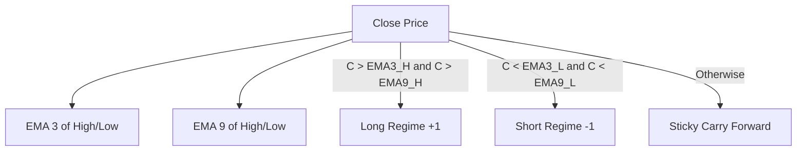

# Regime DNA Research Blueprint
*A Living Specification for Regime-Based Quantitative Trading Research*

---

## Part I — Philosophy

### 1. Research Objective
The core objective of the **Regime DNA** framework is to shift quantitative modeling away from standard bar-by-bar forecasting (e.g., predicting the next minute's close) toward modeling **regimes as discrete, organic structural units**. Within these structural units, we model the continuous evolution of trend health and opportunity decay to make path-dependent trading decisions.

### 2. Why Regime-Based Instead of Bar-Based?
Financial price series are characterized by high noise, non-stationarity, and shifting volatility. Bar-based models suffer from:
* **Trivial Autocorrelation**: High correlation between consecutive close prices leads to models that predict the current price as the next price.
* **Structural Blindness**: A model predicting bar-to-bar cannot distinguish between a pullback in a strong trend and the start of a terminal collapse.
* **Regime alignment**: Regimes group price action into macro-structures (e.g., "confirmed long trend") bounded by structural events (flips). This allows the model to learn path characteristics *relative to the start of the regime*.

### 3. Why Causal Modeling?
Every feature calculation, scaling parameter, and label boundary must be strictly causal. In this framework, a calculation is causal if it is computed using only data available at or before the decision timestamp \(t \le \text{decision\_ts}\). 
* Any lookahead leak (e.g., using the regime's future high to scale a feature at Bar 4) invalidates the research and creates a backtest illusion.
* Real-time production code must run exactly the same feature-generation pipeline as the training code.

### 4. Why NautilusTrader (NT) Event-Driven Validation is the Final Authority
Offline research (e.g., in Jupyter Notebooks or vectorized backtesters) is highly optimistic and serves only as a rough filter. A strategy must pass full event-driven validation inside NautilusTrader because NT enforces:
* **Realistic Order Lifecycles**: Simulates order placement, queued status, fills, cancellations, and expirations. (e.g., discovering that FOK orders cancel under fast markets).
* **Execution Friction**: Simulates bid-ask spreads, queue position, and slippage.
* **Order Book Sweep / Partial Fills**: Simulates filling orders across multiple price levels, exposing position-drift bugs when fill events are not accounted for correctly.
* **Transaction Costs**: Enforces per-contract commissions and exchange fees.

### 5. Common Failure Modes Discovered & Resolved
* **Lookahead Leak**: Using future peak price inside the regime to calculate the current bar's drawdown. *Resolution*: Maintain a running peak variable updated only as new bars close.
* **Selection Bias**: Evaluating a model only on regimes that survive to Bar 4 without accounting for the baseline rate of immediate failures (races that die at Bar 1–3).
* **Survivor Bias**: Designing exit rules that rely on the existence of long-running trends. If the entry model has negative expectancy (like NQ V_A overall), adding exit rules merely slows down the rate of loss rather than creating profitability.
* **Composition Shift**: Training a KNN on historical data where high-volatility trends dominate, and querying it in a low-volatility congestion year (e.g., 2026 OOS). The distance metric will pull neighbors from structurally different market states.
* **Event Overlap**: Simulating multiple trades occurring simultaneously in the backtest, which can artificially inflate returns if position limits are not constrained.
* **Offline Optimism**: Vectorized models assuming instant exits at the close price of a bar, whereas event-driven runs face slippage and queue latency.

---

## Part II — Regime Construction

Regimes partition the price series into discrete states based on a dual-EMA boundary system.



### 1. EMA Calculations
We maintain exponential moving averages (EMA) of the bar highs and lows:
* **EMA 3**: 
  \[\alpha_3 = \frac{2}{3 + 1} = 0.5\]
  \[\text{EMA3\_H}_t = 0.5 \cdot H_t + 0.5 \cdot \text{EMA3\_H}_{t-1}\]
  \[\text{EMA3\_L}_t = 0.5 \cdot L_t + 0.5 \cdot \text{EMA3\_L}_{t-1}\]
* **EMA 9**: 
  \[\alpha_9 = \frac{2}{9 + 1} = 0.2\]
  \[\text{EMA9\_H}_t = 0.2 \cdot H_t + 0.8 \cdot \text{EMA9\_H}_{t-1}\]
  \[\text{EMA9\_L}_t = 0.2 \cdot L_t + 0.8 \cdot \text{EMA9\_L}_{t-1}\]

### 2. Wilder's Average True Range (ATR)
We calculate the Average True Range over a 14-period window:
* **True Range (TR)**:
  \[\text{TR}_t = \max(H_t - L_t, |H_t - C_{t-1}|, |L_t - C_{t-1}|)\]
* **ATR (14)**:
  \[\text{ATR}_t = \frac{\text{ATR}_{t-1} \cdot 13 + \text{TR}_t}{14}\]

### 3. Regime Tracker Rules
* **Long Regime (\(R = +1\))**:
  Triggered when the close price \(C_t\) crosses above both EMA3_high and EMA9_high:
  \[C_t > \text{EMA3\_H}_t \quad \text{AND} \quad C_t > \text{EMA9\_H}_t\]
* **Short Regime (\(R = -1\))**:
  Triggered when the close price \(C_t\) crosses below both EMA3_low and EMA9_low:
  \[C_t < \text{EMA3\_L}_t \quad \text{AND} \quad C_t < \text{EMA9\_L}_t\]
* **Indeterminate / Neutral**:
  If the close does not meet either criteria, the regime carries forward its previous value (sticky):
  \[R_t = R_{t-1}\]

### 4. Regime Lifetimes & Warmup
* **Regime Start**: The close of the bar that triggers the regime flip.
* **Regime End**: The close of the bar that triggers the opposite regime flip.
* **Warmup**: A minimum of 14 bars is required to initialize the Wilder ATR calculator before any regime signals are valid.

### 5. Bar+1 Confirmation Rules
To filter out false breakouts, entry signals require confirmation on the bar immediately following the flip (Bar 1):
* **Long Flip Confirmation**:
  \[H_1 > H_0 \quad (\text{New High}) \quad \text{AND} \quad C_1 > O_1 \quad (\text{Positive Momentum})\]
* **Short Flip Confirmation**:
  \[L_1 < L_0 \quad (\text{New Low}) \quad \text{AND} \quad C_1 < O_1 \quad (\text{Negative Momentum})\]
* **Action**: If both conditions pass, the trade state shifts to confirmed. If either fails, the pending flip is discarded, preventing entry.

---

## Part III — Feature Timeline

To prevent data leakage, we structure our feature vectors and labels chronologically. The timeline below illustrates what features and labels are legally available at each stage of a Long trade.

```
Regime Flip (Bar 0) ──> Bar 1 (Confirmation) ──> Bar 2 ──> Bar 3 ──> Bar 4 (Sizing) ──> Exit/Flip
```

| Time Step | Available Features (Causal) | Forbidden Features (Non-Causal) | Allowed Labels | Forbidden Labels |
| :--- | :--- | :--- | :--- | :--- |
| **Flip (Bar 0)** | Pre-regime DNA features (EMA slope, 15m compression) | Bar 1+ prices, ATR, or volume | None | Any future trade performance |
| **Bar 1** | Bar 1 OHLC, confirmation status, 60s micro features | Bar 2+ metrics | QuickFailure (known if flip occurs) | Runner status, remaining path PnL |
| **Bar 2–3** | MFE/MAE so far, age in regime, volume percentile | Bar 4+ metrics | None | Sizing outputs |
| **Bar 4** | All cumulative stats up to Bar 4 close (12 base features) | Bar 5+ path metrics | `newhigh3`, `flip3` (for training reference) | Ultimate regime MFE/MAE |
| **Exit / Flip** | All historical path data (for training database) | Future regimes | All targets (MFE, MAE, realized PnL) | None |

---

## Part IV — Label Definitions

We train the model using standardized labels that describe the path trajectory of the regime. All labels are normalized by the ATR at entry to allow comparison across volatility environments.

### 1. QuickFailure (QF)
* **Purpose**: Identify trades that collapse immediately after entry.
* **Formula**:
  \[\text{QF} = 1 \quad \text{if} \quad \text{regime\_duration} \le 3 \text{ bars}\]
* **Reason it exists**: Allows the strategy to bypass entry or instantly exit if confirmation fails.
* **Pros**: Highly accurate; easy to classify.
* **Cons**: Provides no information about trades that survive past the initial bars.

### 2. Bad Short (BS) / Bad Long (BL)
* **Purpose**: Isolate trades that enter chop zones and fail to gain traction.
* **Formula**:
  \[\text{BS} = 1 \quad \text{if} \quad \text{regime\_duration} \le 10 \text{ bars} \quad \text{AND} \quad \text{MFE\_lifetime} \le 0.25 \text{ ATR}\]
* **Reason it exists**: Protects capital from trading costs in flat markets.
* **Pros**: Prevents holding through prolonged congestion.
* **Cons**: Can cut trades that have slow, high-health accumulation phases.

### 3. Runner
* **Purpose**: Identify high-velocity trending runs.
* **Formula**:
  \[\text{Runner} = 1 \quad \text{if} \quad \text{MFE\_lifetime} \ge 2.5 \text{ ATR}\]
* **Reason it exists**: Sizing modulation aims to maximize size on these specific regimes.
* **Pros**: Represents the source of all trend-following profitability.
* **Cons**: Low base rate (typically ~15–20% of all regimes).

### 4. Chop
* **Purpose**: Label neutral, non-directional regimes.
* **Formula**:
  \[\text{Chop} = 1 \quad \text{if} \quad \text{MFE\_lifetime} < 1.0 \text{ ATR} \quad \text{AND} \quad \text{QuickFailure} == 0\]
* **Reason it exists**: Baseline class representing trend exhaustion.
* **Pros**: Isolates congestion.
* **Cons**: Hard to distinguish from early pullbacks.

---

## Part V — KNN Framework

We use a Nearest Neighbors framework to query historical regimes that match the current regime's signature.

### 1. Distance Metric & Normalization
* **Distance Metric**: Weighted squared Euclidean distance:
  \[d(\mathbf{x}, \mathbf{y}) = \sum_{j=1}^{D} w_j \cdot (x_j - y_j)^2\]
* **Normalization**: Features are scaled independently using a `RobustScaler` fit on the In-Sample (IS) reference database to prevent outliers from distorting distance:
  \[x'_j = \frac{x_j - \text{median}(x_j)}{\text{IQR}(x_j)}\]
* **Feature Block Weights**: Features are grouped into DNA (structure before flip) and Live (state since entry) blocks. Each scaled feature is multiplied by the square root of its block weight divided by the block dimension:
  \[w_{dna} = 0.40, \quad w_{live} = 0.50, \quad w_{prob} = 0.10\]

### 2. KNN Feature Vector
For queries at Bar \(k\), the feature vector contains:
1. `bar_idx`: Current age in regime (\(k - 4\)).
2. `mfe_sofar`: Max favorable excursion from entry in ATR.
3. `mae_sofar`: Max adverse excursion from entry in ATR.
4. `pnl_now`: Current close price paper PnL in ATR.
5. `pullback`: Peak MFE minus current PnL (\(\text{MFE} - \text{PnL}\)).
6. `progress_count`: Count of new MFE expansion points since Bar 4.
7. `consec_noncont`: Bars since the last new MFE point (stall duration).
8. `dist_flip_open`: Distance from current close to the regime's open price.
9. `health_ratio`: \(\frac{\text{MFE}}{\max(\text{MAE}, 0.1)}\).
10. `close_loc`: Location of current close inside the bar's range:
    \[\text{close\_loc} = \frac{C_k - L_k}{H_k - L_k} \quad (\text{Long})\]
11. `range_exp`: Current bar range divided by ATR_20.
12. `vol_exp`: Current volume divided by the 5-bar mean volume.

### 3. Prediction Outputs
The \(k=500\) nearest neighbors are queried to extract:
* \(P(\text{new\_high}_3)\): Percentage of neighbors that achieve a new high within 3 bars.
* \(P(\text{flip}_3)\): Percentage of neighbors that flip within 3 bars.
* Expected MFE / MAE: Mean remaining path excursion of the neighbors.
* Class Probabilities: Proportions of neighbors resolving to Runner, Continuation, Chop, or Failure.

### 4. Continuous Health Score (\(hC\))
The trend health metric \(hC\) is defined as:
\[hC = P(\text{new\_high}_3) - P(\text{flip}_3)\]
* **Peak Health**: \(\text{peak\_hC} = \max_{j \ge 4} hC_j\).
* **Health Drawdown**: \(dd = \text{peak\_hC} - hC_t\).
* **Health Velocity**: \(dhC = hC_t - hC_{t-3}\).
* **State Definitions**:
  * **Healthy**: \(hC \ge 0.50\)
  * **SoftStall**: \(0.10 \le hC < 0.50\)
  * **HardStall**: \(dd \ge 0.20\) while predicted class is Continuation/Runner.
    * *High-Health HS*: \(hC \ge 0.50\) (Pullback)
    * *Low-Health HS*: \(hC < 0.10\) (Collapse)
  * **DETER**: \(hC < 0.10\) or predicted class is Failure/Chop.

---

## Part VI — ML Models

While KNN acts as our primary state-estimator, we utilize LightGBM (Model B) for offline classification tasks.

### 1. Training Setup
* **Framework**: LightGBM Classifier.
* **Training Style**: Walk-Forward. We segment the dataset by year; the model for year \(Y\) is trained strictly on years \(< Y\).
* **Features**: Combines pre-flip DNA features (15m/30m slope, volume z-scores) and live microstructure features.

### 2. Walk-Forward Segmentation
* **IS Database**: 2021–2024 data (capped at 40,000 reference rows to optimize memory and speed).
* **OOS Test Year**: 2025 and 2026 data.

---

## Part VII — Validation Framework

Every proposed strategy overlay or sizing policy must undergo an 8-stage audit before acceptance.

```
1. Control A (Hold) ──> 2. Control B (Warning) ──> 3. Timing Control ──> 4. Random Rejection
                                                                              │
5. NT Validation <── 6. Lookahead Audit <── 7. Coverage Audit <── 8. Composition Audit
```

1. **Control A (Baseline)**: The standard strategy running without any health filter or sizing.
2. **Control B (Static Warning)**: Exiting or scaling out on a static DETER warning.
3. **Timing Control**: Shifting the signal execution forward/backward by 1–2 bars to check for alignment sensitivity.
4. **Random Rejection**: Applying a random entry filter with the same pass-rate as the KNN to verify mathematical edge.
5. **Composition Audit**: Checking that the nearest neighbors are structurally similar to the query regime.
6. **Coverage Audit**: Ensuring the model makes predictions across a wide distribution of regimes, not just a small, select subset.
7. **Lookahead Audit**: Running a dependency analysis to ensure no future data is referenced in features or states.
8. **NT Event-Driven Validation**: Running the exact strategy parameters in the NautilusTrader backtest loop to check for execution friction, costs, and order constraints.

---

## Part VIII — Decision Ladder

This ladder defines the hurdle gates for deployability:

```
1. Can it beat random? (Falsifies random null benchmark)
   ↓ (YES)
2. Does it survive OOS? (Maintains edge in 2025-2026 OOS)
   ↓ (YES)
3. Does it survive timing? (Not sensitive to execution bar delays)
   ↓ (YES)
4. Does it survive NT? (No order rejections, deadlocks, or state drifts)
   ↓ (YES)
5. Can it survive costs? (Expectancy covers commissions and bid-ask slippage)
   ↓ (YES)
DEPLOY
```

---

## Part IX — Findings

The following table summarizes the performance and findings of our models:

| Model / Policy | Good | Bad | Expectancy / Net PnL (Pooled) | Status |
| :--- | :--- | :--- | :--- | :--- |
| **Model B (LightGBM)** | Excellent fail classifier. | Does not create net positive expectancy due to timing lags. | -$12.45/tr | **REJECTED** |
| **hC Score (KNN)** | Monotonically tracks trend continuation power and lifetime. | Not a directional predictor; cannot filter bad entries. | N/A (Regime monitor) | **VALIDATED** |
| **Discrete Sizing** | Increases size on high-health regimes. | Wiped out by entry/exit execution friction at Bar 4 close. | -$14,740.00 | **REJECTED** |
| **Continuous Sizing** | High-precision sizing scaling. | Suffers from high transaction cost decay. | -$103,973.98 | **REJECTED** |

> [!IMPORTANT]
> **Why Sizing Failed (Pre-Sizing PnL Dominance)**: Over 92% of the trade's positive move occurs in the first 4 minutes before the sizing order executes. The cost of adding contracts at Bar 4 close ($30.00 RT commission + slippage) exceeds the remaining expected post-bar profit ($0.78 expected gain).

---

## Part X — Open Research

### Current Frontier: 5s Pullback and Order Flow Alignment
To bypass "The Cost Trap" of sizing up at Bar 4 close, research is moving to:
1. **1m hC Filtering**: Identify the highest-health regimes at Bar 4.
2. **5s Refinement**: Instead of entering immediately, wait for a 5s pullback *within* the high-health regime.
3. **Order Flow Gate**: Use volume profile and imbalance signatures to confirm the end of the pullback, entering at a much lower cost basis.
4. **NT Validation**: Test the multi-timeframe 1m/5s strategy inside the Nautilus event loop.

---

## Part XI — Research Principles Learned

* **NT Survival is Mandatory**: Any offline model result is an illusion until it survives transaction costs and order lifecycle constraints in NautilusTrader.
* **Baseline Priority**: Never optimize a model or add exit filters before reproducing and auditing the baseline strategy's raw execution.
* **Audit First, Interpret Later**: Check for lookahead leaks, composition shifts, and bad fills before analyzing performance metrics.
* **Geometry Over Expectancy**: Price geometry (like MFE/MAE paths) consistently categorizes trade structures better than raw PnL curves.
* **Opportunity vs. Direction**: Predicting whether a trend will continue (opportunity) is mathematically different from predicting whether the next bar is up or down (direction).
* **State Over Binary**: Use continuous state variables (like \(hC\)) to manage risk rather than binary classifiers, which compress and destroy signal resolution.

---

## Part XII — Porting to a New Instrument

Follow this step-by-step playbook to port the Regime DNA model to a new market (e.g., ES, CL, GC):

### Step 1: Instrument Data Ingestion
* Import 1-minute and 1-second historical bars for the target instrument.
* Build the NautilusTrader catalog.

### Step 2: Volatility & Regime Calibration
* Measure the distribution of price ranges to calibrate the Wilder ATR period.
* Adjust the EMA lengths (e.g., EMA3/EMA9) if the instrument exhibits higher noise or mean-reverting tendencies.

### Step 3: Run Baseline Simulation
* Run the baseline strategy without filters.
* Extract the raw regime lifetimes, average MFE/MAE, and baseline win rate.

### Step 4: Extract Health Capsule
* Run the feature pipeline to extract the pre-flip DNA features and live path states for all completed regimes.
* Save the output to `early_health_capsule.parquet`.

### Step 5: Train Walk-Forward KNN
* Fit the Nearest Neighbors model on historical data.
* Calibrate the distance weights based on the instrument's specific features (e.g., volume profile or ATR expansion).

### Step 6: Generate hC Mapping
* Run `extract_hc_mapping.py` to generate the precomputed Bar-4 health score map for the target instrument.

### Step 7: NautilusTrader Backtesting
* Run the `hc_sizing_strategy.py` with the new mapping file.
* Audit the run logs to verify zero order rejections.

### Step 8: Perform Cost Synthesis
* Verify if the post-sizing expectancy exceeds the transaction fees and bid-ask spread of the target instrument.
