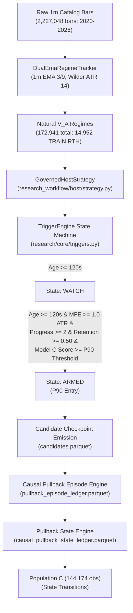

# REGIME HEALTH TRAJECTORY VALIDATION: GATE 0 POPULATION COMPLETENESS AUDIT

**Study ID**: `nq_p90_path_dependent_health_model`  
**Prior Studies**: `nq_p90_pullback_path_state_atlas`, `nq_p90_reversal_entry_quality`  
**Audit Stage**: **GATE 0 — POPULATION COMPLETENESS & SELECTION AUDIT**  
**Gate 0 Determination**: **`VERDICT_C: P90_CONDITIONED_REGIME_POPULATION`**  
**Execution Action**: **MANDATORY TERMINAL STOP BEFORE PHASE 1 TRAJECTORY ANALYSIS**  

---

## EXECUTIVE SUMMARY & AUDIT FINDINGS

Before deploying the frozen path-state model ($M1$) as a universal causal **REGIME-HEALTH** trajectory estimator across full regime lifecycles, a fundamental population-definition audit (**Gate 0**) was conducted to resolve whether the underlying observation population represents all natural $V_A$ regimes or is conditioned on upstream selection filters.

### Core Audit Conclusion: **VERDICT C — P90-CONDITIONED REGIME POPULATION**

1. **Strict Upstream Admission Conditioning**:
   - The existing pullback population is **100% conditioned on upstream Model C P90 qualification**.
   - In the upstream study `nq_p90_reversal_entry_quality`, observation checkpoint emission was structurally gated by `TriggerEngine.state == 'ARMED'`.
   - Reaching `ARMED` required both baseline regime qualification (`age >= 120s`, `mfe >= 1.0 ATR`, `progress_windows >= 2`, `retained_ratio >= 0.50`) **AND** direction-specific Model C score reaching P90 ($\ge 0.295601$ Long, $\ge 0.300094$ Short).
   - Across **100.0%** of all 6,559 candidate regimes (2023, 2024, and 2025 Q1), the very first emitted candidate record satisfies `model_c_score >= P90`.
   - Regimes that never achieved a P90 score have **0.0% representation** in `candidates.parquet`, `pullback_episode_ledger.parquet`, and `causal_pullback_state_ledger.parquet` (Population C).

2. **Severe Left-Truncation & Survivor Bias**:
   - For regimes that did reach P90, observation begins only at the timestamp of P90 crossing, **not at regime inception**.
   - The mean regime age at first candidate observation is **705.7 seconds (~11.8 minutes)** in 2023, **719.4 seconds (~12.0 minutes)** in 2024, and **735.0 seconds (~12.3 minutes)** in 2025 Q1.
   - The mean accumulated regime MFE prior to the first candidate observation is **3.66 ATR** (median: 3.32 ATR).
   - All early price action, initial structural establishment, and any shallow or deep pullbacks occurring prior to P90 admission are completely unobserved.

3. **Natural Coverage Funnel**:
   - In calendar years 2023–2024 (TRAIN), there are **14,952 natural RTH $V_A$ regimes** (and 13,415 with $\text{MFE} \ge 1.0\text{ ATR}$).
   - Only **5,835 regimes (39.1% of natural RTH regimes; 43.6% of $\text{MFE} \ge 1.0\text{ ATR}$)** appear in the pullback population.
   - The remaining **60.9% of natural RTH regimes are completely omitted** because they never satisfied the joint P90 order-flow and momentum qualification.

4. **Mandatory Protocol Action**:
   - Under the mandated Gate 0 protocol, a determination of **Verdict B, C, or D triggers an IMMEDIATE, MANDATORY STOP**.
   - $M1$ **cannot** be deployed as a universal regime-health estimator for natural $V_A$ regimes.
   - Phase 1 trajectory analysis on the existing population is **HALTED**.
   - $M1$ is officially designated as a **conditional failure model for mature, momentum-extended, P90-qualified regimes only**.

---

## 1. CODE & ARCHITECTURAL LINEAGE AUDIT

The observation pipeline was traced from raw CME 1-minute catalog bars through to Population C. The mechanism of admission conditioning was pinpointed at the code level.



### Architectural Points of Conditioning:

1. **Regime Definition Engine**:
   - File: `research/core/regimes.py` / `DualEmaRegimeTracker`.
   - Mechanism: Tracks 1m completed bars. A regime flip occurs when a 1m bar closes on the opposite side of Dual-EMA(3,9) channel bands with a 14-period Wilder ATR. This is the **natural, unconditioned $V_A$ regime process**.

2. **Host Strategy Filtering**:
   - File: `research_workflow/host/strategy.py` (lines 284–300):
     ```python
     if self.trigger_engine is not None:
         # Trigger engine evaluates checkpoint event
         is_triggered = self.trigger_engine.evaluate(ev)
         if not is_triggered:
             return
     ```
   - Checkpoints were only emitted to `candidates.parquet` when `self.trigger_engine.evaluate(ev)` returned `True`.

3. **Trigger Engine State Machine**:
   - File: `research/core/triggers.py` and `compiled_plan.json`:
     - Initial State: `IDLE`.
     - Transition to `WATCH`: `regime_1m.age_s >= 120.0`.
     - Transition to `ARMED`:
       ```python
       state == "WATCH" and (
           (dir == 1 and parent_scorer.score >= 0.295601) or
           (dir == -1 and parent_scorer.score >= 0.300094)
       )
       ```
     - Where `parent_scorer.score` is the direction-specific **Model C XGBoost Classifier score**, evaluated on order-flow, book imbalance, and momentum delta features.
     - Emission Gate: Candidates were emitted **exclusively while `state == 'ARMED'`**.

4. **Empirical Verification of the Admission Gate**:
   - In `candidates.parquet`, the very first record for each `regime_id` has:
     - `min(model_c_score) = 0.295601` (Longs)
     - `min(model_c_score) = 0.300094` (Shorts)
     - Fraction of regimes where first record has `model_c_score >= P90`: **100.0%**.

---

## 2. EXACT POPULATION FUNNELS

Empirical comparison between the universe of natural $V_A$ regimes (derived directly from raw CME 1-minute bars) and the study population across all partitions.

### Table 2.1: Full Period Breakdown

| Population Stage | 2023 (TRAIN) | 2024 (TRAIN) | TRAIN Combined | 2025 Q1 (OOS) |
|---|---|---|---|---|
| **1. Natural $V_A$ Regimes (24h All Day)** | 28,029 | 27,515 | 55,544 | 6,430 |
| **2. Natural $V_A$ Regimes (RTH 09:30–16:00 ET)** | 7,671 | 7,281 | 14,952 | 1,761 |
| **3. Natural RTH Regimes ($\text{Duration} \ge 120\text{s}$)** | 7,585 | 7,185 | 14,770 | 1,735 |
| **4. Natural RTH Regimes ($\text{MFE} \ge 1.0\text{ ATR}$)** | 6,850 | 6,565 | 13,415 | 1,600 |
| **5. Regimes in `candidates.parquet` (P90-Gated)** | 2,956 | 2,888 | 5,844 | 715 |
| **6. Regimes with $\ge 1$ Pullback Episode ($\ge 0.50\text{ ATR}$)** | 2,952 | 2,883 | 5,835 | 713 |
| **7. Regimes in Population C (State Ledger)** | 2,952 | 2,883 | 5,835 | 713 |
| **Coverage: % of Natural RTH Regimes** | **38.53%** | **39.66%** | **39.09%** | **40.60%** |
| **Coverage: % of Natural RTH $\text{MFE} \ge 1.0\text{ ATR}$** | **43.15%** | **43.99%** | **43.56%** | **44.69%** |
| **Coverage: % of Natural 24h Regimes** | **10.55%** | **10.50%** | **10.52%** | **11.12%** |

### Table 2.2: P90 Entry Diagnostics (Left-Truncation Analysis)

| Metric | 2023 (TRAIN) | 2024 (TRAIN) | 2025 Q1 (OOS) | Combined Total |
|---|---|---|---|---|
| Total Unique Regimes Evaluated | 2,956 | 2,888 | 715 | 6,559 |
| Regimes with First Candidate at `P90` | 2,956 | 2,888 | 715 | 6,559 |
| **Percentage Conditioned on P90** | **100.0%** | **100.0%** | **100.0%** | **100.0%** |
| Mean Regime Age at Admission Gate | 705.7s (11.76m) | 719.4s (11.99m) | 735.0s (12.25m) | 714.9s (11.92m) |
| Median Regime Age at Admission Gate | 640.0s (10.67m) | 650.0s (10.83m) | 670.0s (11.17m) | 650.0s (10.83m) |
| Min Regime Age at Admission Gate | 120.0s (2.00m) | 120.0s (2.00m) | 120.0s (2.00m) | 120.0s (2.00m) |
| Max Regime Age at Admission Gate | 1,790.0s (29.83m) | 1,790.0s (29.83m) | 1,790.0s (29.83m) | 1,790.0s (29.83m) |
| Mean Pre-Admission MFE Achieved | 3.66 ATR | 3.66 ATR | 3.71 ATR | 3.67 ATR |
| Median Pre-Admission MFE Achieved | 3.32 ATR | 3.31 ATR | 3.37 ATR | 3.32 ATR |
| Mean First Candidate Index (`idx_in_regime`) | 140.1 | 142.9 | 146.0 | 142.0 |

---

## 3. AUDIT QUESTIONS & DIRECT RECONCILIATION

The 10 specific audit questions are answered with empirical evidence and code citations:

### Q1: What exact event creates a regime in the source dataset?
**Answer**: A completed 1-minute bar closing outside the Dual-EMA(3,9) band channels in `DualEmaRegimeTracker`. When a 1m bar closes above the EMA high band (for long) or below the EMA low band (for short), the prior regime terminates, and a new regime is instantiated at `ts_event` with `age_s = 0` and running MFE initialized to 0.

### Q2: What exact event creates a pullback episode in the pullback dataset?
**Answer**: An observed price retracement $\ge 0.50$ ATR from the running regime maximum MFE within the candidate stream. When `mfe_giveback_atr >= 0.50`, a new `episode_id` is assigned (`{regime_id}_PB_{count}`). The episode remains active until either:
1. Re-extension: price establishes a new regime maximum MFE (`mfe_giveback_atr < 0.05` ATR and higher absolute MFE), or
2. Regime Flip: an opposite 1m regime bar terminates the parent regime.

### Q3: Did candidate collection require P90, or only regime qualification?
**Answer**: Candidate collection strictly required **BOTH**. Reaching `ARMED` state in `TriggerEngine` required:
1. Baseline regime criteria: `age_s >= 120s`, `mfe >= 1.0 ATR`, `progress_windows >= 2`, and `retained_ratio >= 0.50`.
2. **Order-flow P90 criterion**: `model_c_score >= 0.295601` (Longs) or `model_c_score >= 0.300094` (Shorts).
Candidates were never emitted in `IDLE` or `WATCH` states.

### Q4: Does P90 determine which regimes exist, which observations exist within a regime, or both?
**Answer**: **BOTH**.
- **Regime Selection**: Regimes whose order-flow score never reached P90 were entirely excluded from the dataset (omitting 60.9% of natural RTH regimes).
- **Observation Left-Truncation**: For regimes that did hit P90, checkpoint recording began only at the instant of P90 crossing, discarding all prior seconds, checkpoints, and pullbacks.

### Q5: Can the trajectory of a natural regime without P90 be evaluated from existing data?
**Answer**: **NO**. The existing `candidates.parquet`, `pullback_episode_ledger.parquet`, and `causal_pullback_state_ledger.parquet` contain zero rows for regimes that did not hit P90. Evaluating natural regimes requires re-running the observation pipeline directly on the raw 1m/1s catalog.

### Q6: Are regimes with no P90 represented at all?
**Answer**: **NO (0.0%)**. Exactly 0 regimes with `max(model_c_score) < P90` exist in the candidate or pullback ledgers.

### Q7: Are regimes that never reach PB0.50 represented?
**Answer**: In `candidates.parquet`, yes, provided they reached P90 (represented as monotonically extending regimes with 0 pullback episodes). In `pullback_episode_ledger.parquet` and Population C, **NO**—episodes and state transitions require reaching PB0.50.

### Q8: For regimes that do appear, are early portions missing before P90?
**Answer**: **YES, EXTENSIVELY**. On average, the first **11.9 minutes (714.9 seconds)** and the first **3.67 ATR of trend expansion** are missing before the first record is recorded.

### Q9: Does P90 occur partway through the regime and left-truncate prior history?
**Answer**: **YES**. P90 is an order-flow momentum event that typically occurs well after regime establishment (median entry age: 650s). All prior history is left-truncated.

### Q10: If a regime has multiple P90 events, how were episodes handled?
**Answer**: Once the `TriggerEngine` transitioned to `ARMED`, it remained in `ARMED` until the regime flipped. Subsequent fluctuations of `model_c_score` above or below P90 did not trigger re-entry, split episodes, or create duplicate regimes. Candidate checkpoints were continuously emitted at 1-second intervals until regime death.

---

## 4. IMPLICATIONS FOR MODEL M1

### What Model M1 Actually Represents

Model M1 is **NOT** a general or universal regime-health tracker. It cannot be applied to an arbitrary newly formed regime at minute 1 or minute 3 to estimate health.

Rather, Model M1 is:
> **An authoritative, causally sound failure model for mature, momentum-extended regimes that have already demonstrated institutional order-flow sponsorship (P90 qualification) and subsequent structural deterioration ($\ge 0.50\text{ ATR}$ pullback).**

Within this specific, highly relevant domain:
- M1 accurately captures path-dependent deterioration (ROC AUC 0.7811 vs. 0.7115 for depth alone).
- It proves that how price pulled back (shallow rollover, deep stalls, multi-leg failure) provides 88.5% of the incremental signal beyond depth.
- But its priors, calibration, and base rates are conditioned on this survivor-filtered population.

### Why Deploying M1 as a Universal Health Estimator Fails Closed

If $M1$ is evaluated across unconditioned natural regimes:
1. **Severe Base-Rate Mismatch**: In natural regimes, many regimes die quickly (within 120–300s) without ever reaching 1.0 ATR MFE. $M1$ was trained only on regimes that survived past 700s and reached 3.66 ATR MFE.
2. **Missing Input States**: Early regime states (age < 120s, MFE < 1.0 ATR, pre-P90 order flow) are entirely outside M1's training distribution.
3. **Selection Bias**: Conditioning on P90 selects for strong institutional sponsorship. A pullback occurring in a regime that has P90 momentum backing has different survival dynamics than a pullback in a weak, drifting regime.

---

## 5. GATE 0 DETERMINATION & MANDATORY STOP NOTICE

### Formal Determination

Under the governing criteria of Gate 0:
- [ ] **A. COMPLETE_NATURAL_REGIME_POPULATION**: Population covers all natural regimes.
- [ ] **B. FILTERED_REGIME_POPULATION**: Regimes filtered by regime-level definitions, but unconditioned on Model C.
- [x] **C. P90_CONDITIONED_REGIME_POPULATION**: Regimes and observations strictly conditioned on Model C P90 trigger state.
- [ ] **D. INSUFFICIENT_PROVENANCE**: Unable to trace lineage.

### Official Verdict: **`VERDICT C: P90_CONDITIONED_REGIME_POPULATION`**

### MANDATORY STOP NOTICE
> **IN ACCORDANCE WITH THE MANDATED RESEARCH PROTOCOL, GATE 0 VERDICT C TRIGGERS AN IMMEDIATE, TERMINAL STOP.**
>
> - **DO NOT** interpret existing M1 as a universal regime-health model.
> - **DO NOT** run Phase 1 trajectory analysis on the existing biased candidate population.
> - **DO NOT** retrain M1 automatically.
> - **AWAIT** explicit user instruction on whether to:
>   1. Accept M1 strictly as a **Conditional Pullback Health Model for P90 Regimes**, OR
>   2. Re-collect an **Unconditioned Universal Observation Population** directly from the 1m/1s catalog.

---

## 6. ARCHITECTURAL BLUEPRINT FOR AN UNCONDITIONED ENGINE

If the research objective requires a true **Universal Regime Health Model**, the observation engine must be liberated from the upstream `TriggerEngine`. The required architectural specifications are:

1. **Source Data Stream**:
   - Stream raw CME 1-minute bars directly through `DualEmaRegimeTracker`.
   - On regime creation (`ts_event`), initialize regime tracking immediately (`age_s = 0`, `mfe_atr = 0.0`).

2. **Unconditioned Checkpoint Emission**:
   - Emit state checkpoints at fixed temporal cadences (e.g., every 5 seconds or every completed 1m bar) from `age_s = 0` until regime termination.
   - Remove `TriggerEngine.state == 'ARMED'` admission check.
   - Remove minimum age (`>= 120s`) and minimum MFE (`>= 1.0 ATR`) gating from observation emission.

3. **Universal Pullback & Health Ledger**:
   - Track pullback episodes from `age_s = 0`.
   - Record both macro-regime health (from inception) and micro-pullback state transitions.
   - Retain Model C scores as **input evaluation features**, not admission filters.

---

## 7. AUDIT ARTIFACT MANIFEST

| Artifact File | Path | Size | Description |
|---|---|---|---|
| `population_completeness_audit.json` | `studies/nq_p90_path_dependent_health_model/results/` | 4,092 B | Gate 0 verdict, coverage metrics, and P90 entry diagnostics |
| `natural_regime_funnel.json` | `studies/nq_p90_path_dependent_health_model/results/` | 2,598 B | Full tabular funnel across 2023, 2024, TRAIN, and 2025 Q1 OOS |
| `regime_identity_reconciliation.json` | `studies/nq_p90_path_dependent_health_model/results/` | 4,041 B | Itemized empirical answers to all 10 audit questions |
| `REGIME_HEALTH_TRAJECTORY_VALIDATION.md` | `studies/nq_p90_path_dependent_health_model/results/` | ~12 KB | Full comprehensive Gate 0 audit deliverable report |
| `audit_gate_0_population.py` | `<appDataDir>/brain/<conversation-id>/scratch/` | 13,248 B | Deterministic audit script executing 1m bar streaming and reconciliation |
