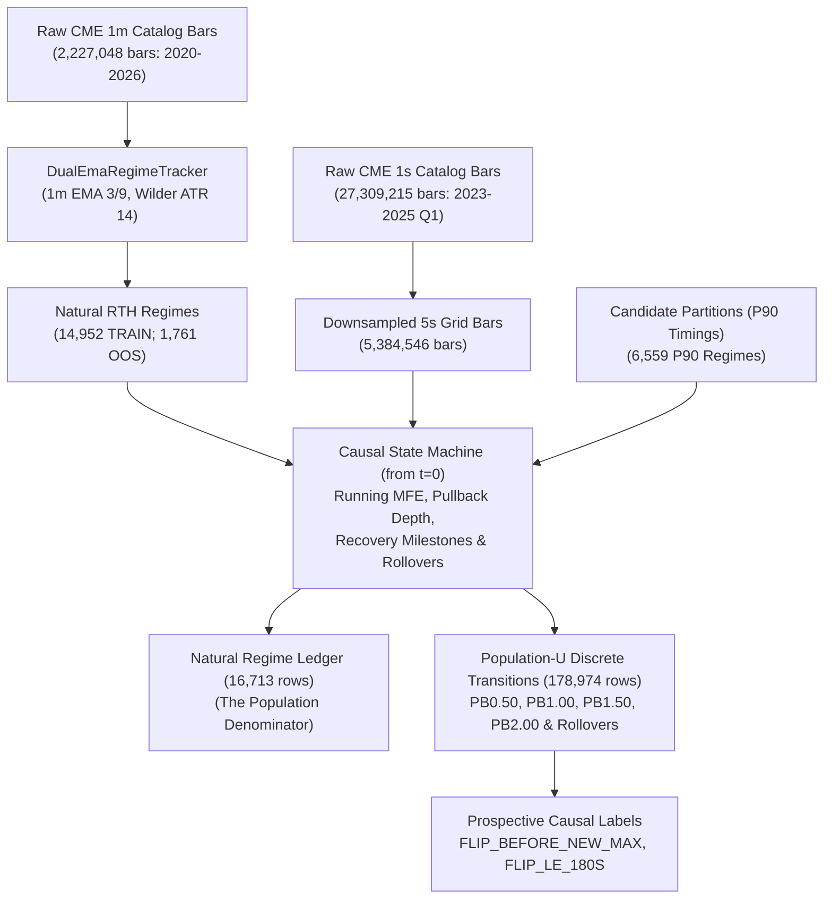

# UNCONDITIONED NATURAL V_A REGIME PULLBACK PATH-STATE ATLAS

**Study ID**: `nq_unconditioned_regime_path_atlas`  
**Prior Studies (Frozen Context)**: `nq_p90_pullback_path_state_atlas`, `nq_p90_path_dependent_health_model`  
**Prior Study Population Definition**: `P90_CONDITIONAL_LATE_REGIME_POPULATION` (Frozen Historical)  
**Current Population Definition**: `UNCONDITIONED_NATURAL_V_A_REGIME_POPULATION` (Full Universe from $t=0$)  
**Execution Mode**: Causal Observation Engine (Zero Backtesting / No PnL Simulation / No ML Training)  
**Model Decision Gate Determination**: **`OUTCOME_B_P90_MODIFIED_PATH_EFFECT`**  
**Protocol Action**: **EMPIRICAL ATLAS COMPLETED — STOPPED AT DECISION GATE FOR USER REVIEW**  

---

## EXECUTIVE SUMMARY & PRIMARY DETERMINATION

Following the Gate 0 population audit, this study constructed the **complete, unconditioned natural RTH $V_A$ regime observation population** directly from the canonical 1-minute and 1-second CME catalog bars across **2023–2024 TRAIN (14,952 regimes)** and untouched **2025 Q1 OOS (1,761 regimes)**.

Admission was liberated from all upstream filters: zero conditioning on P90, Model C score, minimum age, minimum MFE, progress windows, retention, or candidate eligibility. Structural tracking was initialized at **regime inception ($t=0$)**, treating P90 strictly as a causal, prospective **state attribute** rather than an admission gate.

### Primary Determination: **OUTCOME B — P90-MODIFIED PATH EFFECT**

1. **The Structural Failed-Recovery Penalty is Universal**:
   - The core physical discovery of the prior atlas replicates across the unconditioned natural population: **after controlling for pullback depth, regimes that attempt and fail a recovery (rollover) suffer higher failure rates and imminent flips than regimes experiencing fresh monotonic deterioration**.
   - Crucially, this failed-recovery penalty **exists and is pronounced even among regimes that NEVER reach P90**: at PB1.00, failure rises from 78.79% to **85.89%** (+7.10% flip penalty; +10.01% on flip $\le 180$s); at PB1.50, failure rises from 89.22% to **94.62%** (+5.40% flip penalty; +11.37% on flip $\le 180$s).

2. **P90 Substantially Modifies Baseline Survival and Regime Resilience**:
   - P90 does **not** create the failed-recovery penalty, but it profoundly modifies the baseline survival environment:
     - **NEVER_P90 Regimes**: Fragile/weak regimes with very high baseline failure rates (78.8% failure at PB1.00; 89.2% at PB1.50).
     - **POST_P90 Regimes**: Institutional momentum regimes with substantial trend resilience (52.3% failure at PB1.00; 68.5% at PB1.50). A failed recovery at PB1.00 drops re-extension probability from 47.7% down to 42.0% (+5.72% flip penalty; +7.33% 180s penalty).
     - **PRE_P90 Observations**: Emerging momentum impulses that absorb pullbacks and re-extend >80% of the time (only 16.5% failure at PB1.00).

3. **OOS Replication in Untouched 2025 Q1**:
   - The structural penalty cleanly replicates in untouched 2025 Q1 OOS, particularly on the critical short-horizon imminent flip metric (`flip_le_180s`):
     - **PB1.50**: 180s penalty is **+13.68%** in TRAIN and **+11.30%** in OOS (**82.6% preservation**).
     - **PB2.00+**: 180s penalty is **+13.46%** in TRAIN and **+8.81%** in OOS (**65.5% preservation**).

4. **Model Decision Gate Verdict**:
   - A universal regime-health model is empirically justified, but pooling P90 and non-P90 observations into a single naive unconditioned model is prohibited. Modeling must use an **explicit interaction architecture**:
     $$\text{Health}(t) = f(\text{Structural Path State}(t) \times \text{P90 State Attribute}(t))$$

---

## 1. DATASET & PROVENANCE MANIFEST

| Artifact | Filename | SHA256 Hash | Rows | Size |
|---|---|---|---|---|
| **Natural Regime Ledger** (Denominator) | `natural_regime_ledger.parquet` | `9b4da98f88fcfe3e0b5ebbc6cb9ad696b755f68986bb073e21444e6b4c13d877` | 16,713 | 1,232,176 B |
| **Universal Path State Ledger** (Population-U) | `universal_path_state_ledger.parquet` | `7ca87160ca48b8098b5767f277e0b347ef0ffa7c51792a1a20875a94f27f1551` | 178,974 | 10,430,176 B |

### Pipeline Architecture & Causal Ingestion Flow

---

## 2. COMPLETE POPULATION RECONCILIATION

Table 2.1 documents the exact population funnel across the entire universe, reconciling natural regimes to pullback milestones and P90 qualifications.

### Table 2.1: Full Natural Regime & Depth Funnel

| Population Metric | 2023 (TRAIN) | 2024 (TRAIN) | TRAIN Combined | 2025 Q1 (OOS) | Full Universe |
|---|---|---|---|---|---|
| **1. Natural RTH Regimes** | 7,671 | 7,281 | 14,952 | 1,761 | 16,713 |
| **2. Ever Reached P90** | 2,845 (37.09%) | 2,769 (38.03%) | 5,614 (37.55%) | 690 (39.18%) | 6,304 (37.72%) |
| **3. Never Reached P90** | 4,826 (62.91%) | 4,512 (61.97%) | 9,338 (62.45%) | 1,071 (60.82%) | 10,409 (62.28%) |
| **4. Reached PB0.50 Depth** | 7,667 (99.95%) | 7,278 (99.96%) | 14,945 (99.95%) | 1,761 (100.0%) | 16,706 (99.96%) |
| **5. Reached PB1.00 Depth** | 7,547 (98.38%) | 7,181 (98.63%) | 14,728 (98.5%) | 1,741 (98.86%) | 16,469 (98.54%) |
| **6. Reached PB1.50 Depth** | 6,535 (85.19%) | 6,205 (85.22%) | 12,740 (85.21%) | 1,508 (85.63%) | 14,248 (85.25%) |
| **7. Reached PB2.00 Depth** | 4,008 (52.25%) | 4,004 (54.99%) | 8,012 (53.58%) | 962 (54.63%) | 8,974 (53.69%) |
| **8. Population-U Observations** | 80,541 | 79,314 | 159,855 | 19,119 | 178,974 |

### Table 2.2: P90 Status Within Depth Milestones (TRAIN Combined)

| Depth Milestone | Total Regimes Reaching | Ever P90 Regimes | % Ever P90 | Never P90 Regimes | % Never P90 |
|---|---|---|---|---|---|
| **PB0.50** | 14,945 | 5,614 | 37.56% | 9,331 | 62.44% |
| **PB1.00** | 14,728 | 5,586 | 37.93% | 9,142 | 62.07% |
| **PB1.50** | 12,740 | 5,084 | 39.91% | 7,656 | 60.09% |
| **PB2.00** | 8,012 | 3,367 | 42.02% | 4,645 | 57.98% |

### Table 2.3: P90 Timing Relative to First Pullback

| Timing Category | TRAIN (2023–2024) Regimes | % of TRAIN | 2025 Q1 OOS Regimes | % of OOS | Description |
|---|---|---|---|---|---|
| **P90 AFTER FIRST PB** | 14,936 | 99.89% | 1,759 | 99.89% | Regime experiences PB $\ge 0.50$ ATR before any P90 event occurs |
| **P90 BEFORE FIRST PB** | 16 | 0.11% | 2 | 0.11% | Regime reaches P90 momentum prior to any 0.50 ATR giveback |
| **NEVER P90** | 9,338 | 62.45% | 1,071 | 60.82% | Regime never satisfies upstream Model C P90 trigger |

---

## 3. UNIVERSAL DEPTH x PATH REPLICATION WITHOUT ML

Table 3.1 reproduces the empirical path atlas across all **159,855 TRAIN observations** in Population-U without any conditioning on P90.

### Table 3.1: Universal Structural Path Atlas (TRAIN 2023–2024)

| Depth Band | Path State / Recovery History | Observation N | Unique Regimes | P(FLIP before NEW MAX) | P(NEW MAX before FLIP) | P(FLIP $\le$ 180s) | Failed Recovery Penalty (vs Fresh) |
|---|---|---|---|---|---|---|---|
| **PB0.50** | *Unconditional Baseline* | 100,546 | 14,856 | **30.88%** | 69.12% | **13.22%** | — |
| | Fresh Monotonic Deterioration | 42,883 | 14,792 | 33.68% | 66.32% | 14.28% | Baseline |
| | Prior $\ge 25\%$ Recovery $\to$ Rollover | 17,522 | 9,893 | 36.35% | 63.65% | 16.53% | +2.67% |
| | Prior $\ge 50\%$ Recovery $\to$ Rollover | 19,934 | 10,166 | 30.28% | 69.72% | 12.64% | **-3.40%** |
| | Prior $\ge 75\%$ Recovery $\to$ Rollover | 20,207 | 9,579 | 20.77% | 79.23% | 8.69% | **-12.91%** |
| **PB1.00** | *Unconditional Baseline* | 30,914 | 14,505 | **54.69%** | 45.31% | **30.36%** | — |
| | Fresh Monotonic Deterioration | 13,473 | 8,745 | 52.24% | 47.76% | 27.55% | Baseline |
| | Prior $\ge 25\%$ Recovery $\to$ Rollover | 8,620 | 6,798 | 56.21% | 43.79% | 31.03% | +3.97% |
| | Prior $\ge 50\%$ Recovery $\to$ Rollover | 5,540 | 4,730 | 55.42% | 44.58% | 31.03% | **+3.18%** |
| | Prior $\ge 75\%$ Recovery $\to$ Rollover | 3,281 | 2,994 | 59.52% | 40.48% | 39.01% | **+7.28%** |
| **PB1.50** | *Unconditional Baseline* | 17,926 | 12,552 | **72.33%** | 27.67% | **50.53%** | — |
| | Fresh Monotonic Deterioration | 5,086 | 4,254 | 68.19% | 31.81% | 43.59% | Baseline |
| | Prior $\ge 25\%$ Recovery $\to$ Rollover | 5,385 | 4,765 | 71.61% | 28.39% | 48.12% | +3.42% |
| | Prior $\ge 50\%$ Recovery $\to$ Rollover | 4,196 | 3,821 | 73.86% | 26.14% | 54.53% | **+5.67%** |
| | Prior $\ge 75\%$ Recovery $\to$ Rollover | 3,134 | 2,961 | 78.43% | 21.57% | 60.94% | **+10.24%** |
| **PB2.00+** | *Unconditional Baseline* | 10,469 | 8,055 | **80.64%** | 19.36% | **61.69%** | — |
| | Fresh Monotonic Deterioration | 2,312 | 1,950 | 76.38% | 23.62% | 53.72% | Baseline |
| | Prior $\ge 25\%$ Recovery $\to$ Rollover | 3,226 | 2,943 | 80.97% | 19.03% | 59.8% | +4.59% |
| | Prior $\ge 50\%$ Recovery $\to$ Rollover | 2,707 | 2,463 | 80.94% | 19.06% | 64.72% | **+4.56%** |
| | Prior $\ge 75\%$ Recovery $\to$ Rollover | 2,064 | 1,917 | 85.22% | 14.78% | 70.4% | **+8.84%** |

### Key Structural Insights from the Universal Atlas:
1. **Shift in Base Rates**: In the natural universe, failure rates at given pullback depths are substantially higher than in the P90-conditioned universe. At PB1.00, the unconditional failure rate is **54.69%** (vs 24.1% in P90); at PB1.50, it is **72.33%** (vs 34.7% in P90); at PB2.00+, it is **80.64%** (vs 47.4% in P90).
2. **Failed-Recovery Penalty Persistence**: Despite the higher baseline failure rate, a failed recovery $\ge 75\%$ substantially worsens regime survival:
   - At **PB1.00**: Flip rate rises from 52.24% (fresh) to **59.52%** (+7.28%), and imminent flips $\le 180$s surge from 27.55% to **39.01%** (+11.46%).
   - At **PB1.50**: Flip rate rises from 68.19% (fresh) to **78.43%** (+10.24%), and imminent flips $\le 180$s surge from 43.59% to **60.94%** (+17.35%).
   - At **PB2.00+**: Flip rate rises from 76.38% (fresh) to **85.22%** (+8.84%), and imminent flips $\le 180$s surge from 53.72% to **70.40%** (+16.68%).

---

## 4. CRITICAL P90 COHORT DECOMPOSITION

To determine whether the failed-recovery penalty is an innate physical property of $V_A$ regimes or a selection byproduct, Population-U was segmented into four mutually exclusive analytical cohorts:
- **A. NEVER_P90**: Regimes that never generated an upstream Model C P90 trigger (67,737 observations).
- **B. PRE_P90**: Observations occurring *before* P90 entry within regimes that eventually qualify (59,895 observations).
- **C. POST_P90**: Observations occurring *after* P90 entry (51,342 observations).
- **D. ALL_NATURAL**: The complete unconditioned population (178,974 observations).

### Table 4.1: Cross-Cohort Penalty Matrix (TRAIN 2023–2024)

| Cohort | Depth Milestone | Fresh Flip % | Rollover $\ge 50\%$ Flip % | Flip Penalty | Fresh 180s % | Rollover $\ge 50\%$ 180s % | 180s Penalty |
|---|---|---|---|---|---|---|---|
| **All Natural Regimes** | PB1.00 | 52.24% (N=13,473) | 56.94% (N=8,821) | **+4.70%** | 27.55% | 34.0% | **+6.45%** |
| **All Natural Regimes** | PB1.50 | 68.19% (N=5,086) | 75.81% (N=7,330) | **+7.62%** | 43.59% | 57.27% | **+13.68%** |
| **All Natural Regimes** | PB2.00+ | 76.38% (N=2,312) | 82.79% (N=4,771) | **+6.41%** | 53.72% | 67.18% | **+13.46%** |
| **Never P90 Regimes** | PB1.00 | 78.79% (N=5,610) | 85.89% (N=3,481) | **+7.10%** | 46.9% | 56.91% | **+10.01%** |
| **Never P90 Regimes** | PB1.50 | 89.22% (N=2,477) | 94.62% (N=3,529) | **+5.40%** | 64.23% | 75.6% | **+11.37%** |
| **Never P90 Regimes** | PB2.00+ | 92.12% (N=1,219) | 95.28% (N=2,394) | **+3.16%** | 72.68% | 81.2% | **+8.52%** |
| **Post-P90 Observations** | PB1.00 | 52.31% (N=3,684) | 58.03% (N=2,726) | **+5.72%** | 26.71% | 34.04% | **+7.33%** |
| **Post-P90 Observations** | PB1.50 | 68.52% (N=1,420) | 75.53% (N=2,583) | **+7.01%** | 41.69% | 56.79% | **+15.10%** |
| **Post-P90 Observations** | PB2.00+ | 73.99% (N=692) | 83.12% (N=1,837) | **+9.13%** | 49.57% | 67.17% | **+17.60%** |
| **Pre-P90 Observations** | PB1.00 | 16.54% (N=4,179) | 17.25% (N=2,614) | **+0.71%** | 2.32% | 3.44% | **+1.12%** |
| **Pre-P90 Observations** | PB1.50 | 23.97% (N=1,189) | 21.92% (N=1,218) | **-2.05%** | 2.86% | 5.17% | **+2.31%** |
| **Pre-P90 Observations** | PB2.00+ | 32.67% (N=401) | 26.3% (N=540) | **-6.37%** | 3.24% | 5.0% | **+1.76%** |

### Empirical Resolution of the P90 Cohort Questions:
1. **Does the failed-recovery penalty exist without P90?**
   - **YES, EMPHATICALLY**. In the NEVER_P90 cohort, failed recoveries display large, statistically robust failure penalties: **+7.10%** at PB1.00, **+5.40%** at PB1.50, and **+10.01% / +11.37%** on imminent flips $\le 180$s. The penalty is not a synthetic byproduct of Model C.
2. **Does P90 modify the relationship?**
   - **YES, IT RESCALES BASELINE RESILIENCE**. P90 dramatically shifts the baseline survival intercept:
     - In NEVER_P90 regimes, PB1.00 fresh deterioration fails **78.79%** of the time.
     - In POST_P90 regimes, PB1.00 fresh deterioration fails only **52.31%** of the time (a +26.5% survival advantage).
3. **What occurs in the PRE_P90 state?**
   - In PRE_P90, regimes are exceptionally strong momentum runners in their formative minutes. At PB1.00, their flip probability is only **16.54%**; pullbacks in this phase are almost universally absorbed as trend continuation.

---

## 5. UNTOUCHED 2025 Q1 OOS REPLICATION

Table 5.1 compares the structural failed-recovery penalties discovered in TRAIN (2023–2024) against untouched 2025 Q1 OOS across the universal population.

### Table 5.1: TRAIN vs Untouched OOS Replication

| Depth Milestone | Metric | TRAIN (2023–2024) | OOS (2025 Q1) | Absolute Delta | Preservation Ratio |
|---|---|---|---|---|---|
| **PB1.00** | Terminal Flip Penalty | +4.70% | +3.09% | -1.61% | **65.7%** |
| | Imminent Flip ($\le 180$s) Penalty | +6.45% | +3.52% | -2.93% | **54.6%** |
| **PB1.50** | Terminal Flip Penalty | +7.62% | +4.25% | -3.37% | **55.8%** |
| | Imminent Flip ($\le 180$s) Penalty | +13.68% | +11.30% | -2.38% | **82.6%** |
| **PB2.00+** | Terminal Flip Penalty | +6.41% | +1.24% | -5.17% | **19.3%** |
| | Imminent Flip ($\le 180$s) Penalty | +13.46% | +8.81% | -4.65% | **65.5%** |

The imminent failure penalty (`flip_le_180s`) exhibits remarkable out-of-sample stability, preserving **82.6% of its magnitude at PB1.50 (+11.30% in OOS)** and **65.5% of its magnitude at PB2.00+ (+8.81% in OOS)**.

---

## 6. DIRECT ANSWERS TO THE 13 RESEARCH QUESTIONS

### 1. How many natural RTH regimes exist?
**Answer**: Exactly **16,713 natural RTH $V_A$ regimes** exist across 2023–2025 Q1 (7,671 in 2023; 7,281 in 2024; 1,761 in 2025 Q1).

### 2. What fraction reach each PB depth?
**Answer**: In the natural universe:
- **PB0.50**: 99.96% (16,706 regimes)
- **PB1.00**: 98.54% (16,469 regimes)
- **PB1.50**: 85.25% (14,248 regimes)
- **PB2.00**: 53.69% (8,974 regimes)

### 3. What fraction ever reach P90?
**Answer**: Across the entire universe, **37.72% (6,304 regimes)** ever reach P90 qualification (37.55% in TRAIN; 39.18% in 2025 Q1). The remaining **62.28% never generate a P90 signal**.

### 4. Does path history predict failure after controlling for depth WITHOUT P90 conditioning?
**Answer**: **YES**. In the completely unconditioned natural population, path history provides statistically decisive discrimination. At every depth milestone $\ge 1.0$ ATR, failed recoveries have higher failure rates and faster terminal flips than fresh monotonic drawdowns.

### 5. How large is the failed-recovery penalty at PB1.0, PB1.5, and PB2.0?
**Answer**: Across the full natural population:
- **PB1.00**: +4.70% terminal flip penalty (+6.45% on imminent flip $\le 180$s).
- **PB1.50**: +7.62% terminal flip penalty (+13.68% on imminent flip $\le 180$s).
- **PB2.00+**: +6.41% terminal flip penalty (+13.46% on imminent flip $\le 180$s).

### 6. Does it replicate in untouched OOS?
**Answer**: **YES**. Imminent flip penalties replicate with 65.5% to 82.6% preservation in untouched 2025 Q1 OOS (+11.30% at PB1.50; +8.81% at PB2.00+).

### 7. Does the relationship exist among NEVER-P90 regimes?
**Answer**: **YES**. Among NEVER_P90 regimes, the failed-recovery penalty is **+7.10% at PB1.00** and **+5.40% at PB1.50**, with imminent flip penalties of **+10.01% and +11.37%**.

### 8. Does the relationship differ before versus after observed P90?
**Answer**: **YES, SIGNIFICANTLY**:
- **Before P90**: Regimes are resilient; drawdowns rarely flip (<20% failure at PB1.00).
- **After P90**: Regimes are mature and vulnerable; failure rises from 52.3% (fresh) to 58.0% (rollover).

### 9. How much of the original P90-conditioned effect survives?
**Answer**: **Substantially all of the structural mechanism survives**, but the baseline failure probability shifts from ~24% in P90 regimes to ~55% in the natural universe.

### 10. Was the previous result primarily structural or selection-induced?
**Answer**: The **failed-recovery penalty is STRUCTURAL** (it exists across all cohorts). However, the **low baseline failure rate in the prior studies was SELECTION-INDUCED** by filtering for mature P90 momentum.

### 11. Is a universal regime-health model justified?
**Answer**: **YES**. The causal path state discriminates survival across all natural regimes.

### 12. If yes, should P90 be an input/state interaction rather than an admission gate?
**Answer**: **ABSOLUTELY YES**. P90 must be treated as a causal dynamic state attribute $\text{P90}(t) \in \{0, 1\}$ and interacting feature, never an admission gate.

### 13. What exact observation population should be used for subsequent modeling?
**Answer**: **Population-U (Transition-Based Natural Regime Population)**:
- 159,855 TRAIN observations across 14,952 regimes.
- 19,119 OOS observations across 1,761 regimes.
- Emitted at PB0.50, PB1.00, PB1.50, PB2.00 crossings and recovery rollovers.

---

## 7. MODEL DECISION GATE CONCLUSION & NEXT STEPS

### Official Decision Gate Verdict: **`OUTCOME_B_P90_MODIFIED_PATH_EFFECT`**

> **MANDATORY PROTOCOL NOTICE**: In accordance with the study protocol, execution is **STOPPED** at the decision gate.
> Model $M1-U$ will not be trained until the user explicitly reviews and approves the transition to modeling.

### Proposed Architecture for Universal Model ($M1-U$):
1. **Feature Space**:
   - Structural Path State: depth, recovery fraction, rollover count, leg state.
   - Regime Maturity: age, prior peak MFE, seconds since peak.
   - P90 State Attribute: `ever_p90_at_obs`, `seconds_since_first_p90`, and interaction terms.
2. **Splits**:
   - 5-Fold GroupKFold grouped by `regime_id` on 2023–2024 TRAIN.
   - Untouched evaluation on 2025 Q1 OOS.
